# Fault Formations Audit
*Audited by Phase A.4 (faults group)*
*Auditor branch: phase-a4-faults*

---

## Faults: Normal Fault

**v1 reference ID:** `normal-fault`
**Source files involved:** `three-helpers.jsx` — `buildFaultScene()` (shared dispatcher, `subtype === 'normal'` path), `geo-data.jsx` — `REFERENCE_FORMATIONS['normal-fault']`

### Source-code reading summary

- Builder function: `buildFaultScene()` in `three-helpers.jsx`
- REFERENCE_FORMATIONS entry: `geo-data.jsx` → `REFERENCE_FORMATIONS['normal-fault']`
- Key parameters: `dip: 60`, `dip_direction: 90` (east), `throw: 0.9`, `heave: 0.52` (inferred as `throw/tan(dip)`), `strike: 0` (inferred). Three layers: sandstone (base, order 0), shale (middle, order 1), limestone (top, order 2).
- Known deviations from default geometry: none. Geometry is well-formed. `slipVec` uses `downDipVec(60°, 90°)` — HW drops down-dip (east and down). Correct for a normal fault.

**What is rendered:**
1. Block split by `THREE.Plane` at 60°/090°; HW half translated by slip vector.
2. Translucent fault plane quad (opacity 0.22) with outline.
3. Floating label: "Normal 60° / 090°".
4. Throw/heave overlays: datum at mid-layer boundary; solid cyan lines labelled "Throw 0.90 u" and "Heave 0.52 u"; dashed purple pre-slip datum reconstruction.
5. Dip arc overlay at top surface; compass rose; strike line.
6. Layer thickness arrows on FW side.

**What is NOT rendered:**
- No HW / FW block labels.
- No sense-of-motion arrows on the fault plane.
- No stress-state badge ("TENSION" / σ₃).
- No net displacement label (`sqrt(throw² + heave²) ≈ 1.04 u`).
- No stratigraphic age badges on layer faces.

### v1 visualisation

> Placeholder — to be populated by A.2.

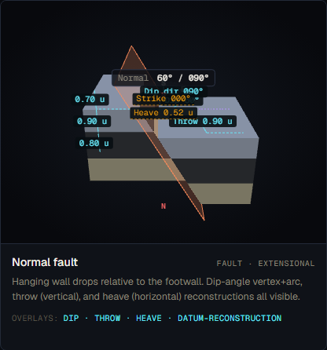
*Screenshot to be captured in Phase A.2.*

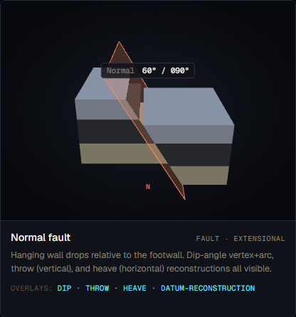
*Screenshot to be captured in Phase A.2.*

### Textbook reference visualisations

> Reference images to be downloaded in A.2.

**Source 1 — LibreTexts Geosciences: Physical Geology (Earle) §12.3 — Fracturing and Faulting**

URL: https://geo.libretexts.org/Bookshelves/Geology/Physical_Geology_(Earle)/12:_Geological_Structures/12.03:_Fracturing_and_Faulting

Expected content: Figure 12.3.5 — block diagram of normal fault with hanging wall (HW) labelled, footwall (FW) labelled, diverging stress arrows indicating extensional regime. The hanging wall is shown descending relative to the stationary footwall.

*Source: LibreTexts Geosciences, "Physical Geology" (Earle), §12.3, accessed 2026-05-18*

**Source 2 — Wikipedia: Fault (geology) — Normal fault section**

URL: https://en.wikipedia.org/wiki/Fault_(geology)#Normal_fault

Expected content: Normal fault cross-section. Wikipedia source states normal faults dip "at least 60 degrees but some normal faults dip at less than 45 degrees." HW above fault plane, FW below. Extension indicated.

*Source: Wikipedia, "Fault (geology)" — Normal fault section, accessed 2026-05-18*

### Accuracy assessment

| Axis | Assessment | Notes |
|---|---|---|
| Geometry | ✓ matches | 60° east dip is textbook-typical (Wikipedia: "at least 60°"). HW displaced down-dip via correct `downDipVec(60°, 90°)` slip vector. Block split geometry is correct. Three-layer sequence (sandstone/shale/limestone) is geologically coherent. |
| Measurement overlays | ⚠ partial | Throw and heave are present and correctly computed. Datum reconstruction (pre-slip HW datum in purple dashes) is technically correct. However: net displacement `sqrt(0.9² + 0.52²) ≈ 1.04 u` is not labelled — students cannot see that displacement ≠ throw. |
| Labels and terminology | ⚠ partial | "Normal 60° / 090°" — correct terminology. Throw and heave labelled correctly. Neither HW nor FW block has any label. Fault plane carries no label. `displacement` absent as a third labelled quantity. |
| Misconception risk | ✗ reinforces | Two §3.4 misconceptions unaddressed: (1) "HW is always on one specific side" — no HW/FW labels to teach the mnemonic; (2) "throw = displacement" — throw and heave shown but not the resultant. No stress-state badge (extensional regime absent). No sense-of-motion arrows on fault plane. |
| Default parameters | ✓ | 60° dip is standard textbook value for normal faults. Throw 0.9 u (37% of 2.4 u stack) is prominent but not unrealistic. Strike 0° (inferred) is arbitrary but reasonable for a schematic. |

### Severity rating

**Rating:** `misleading`

The geometry is correct and the throw/heave overlays function. However, two documented §3.4 misconceptions are reinforced by absence: HW/FW identity is invisible to a student who does not already know it, and the throw/displacement distinction is unresolvable without the net displacement label. The misconception risk axis rates ✗.

### Required v2 work

1. **Add HW/FW colour-coded block labels (spec-v2 §5.2 — required).** "HANGING WALL · HW" (purple) and "FOOTWALL · FW" (teal) floating tags with pointer lines to respective blocks. Applies to all 7 fault formations.
2. **Add sense-of-motion arrows on fault plane (spec-v2 §5.2 — required).** HW arrow pointing down-dip; FW arrow pointing up-dip. Colour-coded to match HW/FW labels.
3. **Add net displacement as a third labelled quantity (spec-v2 §5.2 — required).** Dashed line along fault plane between equivalent piercing points. Label "Displacement N u". Computed as `sqrt(throw² + heave²)`.
4. **Add stress-state badge (spec-v2 §5.2 — required).** "TENSION" pill with outward σ₃ arrows and subtitle "extensional regime."
5. **Add stratigraphic age badges on layer faces (spec-v2 §5.1 — required).** Numbered badges (1 = oldest, N = youngest) on visible slab faces.

### Notes

- `heave` value in JSON (0.52) matches computed `throw / tan(60°) = 0.9 / 1.732 ≈ 0.52`. Renderer recomputes from slip vector anyway; no discrepancy.
- Default camera `{ phi: 1.15, theta: 0.0, dist: 9 }` is orthographic front-on, perpendicular to strike — standard textbook presentation for dip-slip faults. No change needed.
- The normal fault is the worked example in `docs/v2-audit/example-normal-fault.md`; this entry is consistent with that example.

---

## Faults: Reverse Fault

**v1 reference ID:** `reverse-fault`
**Source files involved:** `three-helpers.jsx` — `buildFaultScene()` (`subtype === 'reverse'` path), `geo-data.jsx` — `REFERENCE_FORMATIONS['reverse-fault']`

### Source-code reading summary

- Builder function: `buildFaultScene()` in `three-helpers.jsx`
- REFERENCE_FORMATIONS entry: `geo-data.jsx` → `REFERENCE_FORMATIONS['reverse-fault']`
- Key parameters: `dip: 50`, `dip_direction: 90` (east), `throw: 0.7`, `heave: 0.59` (inferred), `strike: 0` (inferred). Three layers: sandstone (order 0), shale (order 1), limestone (order 2). Tag: "Fault · compressional".
- Known deviations from default geometry: none. `slipVec` uses `upDipVec(50°, 90°)` — HW rides up-dip. Correct for reverse fault.

**What is rendered:**
1. Block split at 50°/090°; HW half translated up-dip by slip vector.
2. Translucent fault plane quad; outline.
3. Floating label: "Reverse 50° / 090°".
4. Throw/heave overlays: datum at mid-layer boundary; "Throw 0.70 u" and "Heave 0.59 u"; dashed pre-slip datum reconstruction.
5. Dip arc overlay; compass rose; strike line.
6. Layer thickness arrows on FW side.

**What is NOT rendered:**
- No HW / FW labels.
- No sense-of-motion arrows on fault plane.
- No stress-state badge ("COMPRESSION" / σ₁ horizontal).
- No net displacement label.
- No stratigraphic age badges.

### v1 visualisation

> Placeholder — to be populated by A.2.

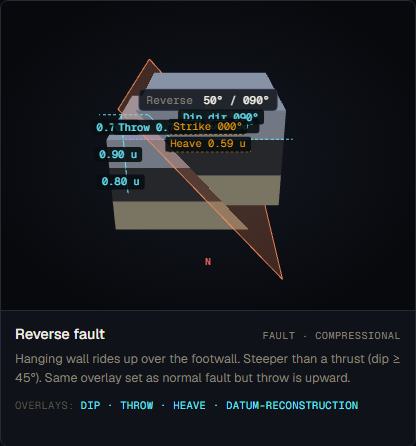
*Screenshot to be captured in Phase A.2.*

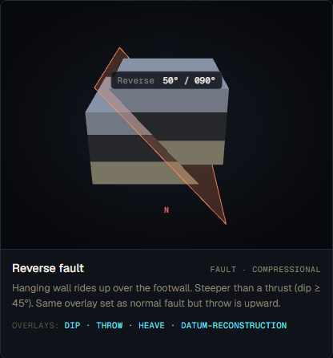
*Screenshot to be captured in Phase A.2.*

### Textbook reference visualisations

**Source 1 — LibreTexts Geosciences: Physical Geology (Earle) §12.3**

URL: https://geo.libretexts.org/Bookshelves/Geology/Physical_Geology_(Earle)/12:_Geological_Structures/12.03:_Fracturing_and_Faulting

Expected content: Reverse fault block diagram (Fig 12.3.5). HW labelled, FW labelled. HW moves up and toward the FW. Converging horizontal stress arrows indicating compressional regime.

*Source: LibreTexts Geosciences, "Physical Geology" (Earle), §12.3, accessed 2026-05-18*

**Source 2 — Geological Digressions: Fault Terminology**

URL: https://www.geological-digressions.com/faults-some-common-terminology/

Expected content: Dip-slip schematic showing reverse fault. Text states "most normal faults dip >60°" and distinguishes reverse from thrust by the 45° dip boundary.

*Source: Geological Digressions, "Faults — some common terminology," accessed 2026-05-18*

### Accuracy assessment

| Axis | Assessment | Notes |
|---|---|---|
| Geometry | ⚠ partial | 50° dip is within the accepted reverse fault range (>45°, distinguishing it from thrust <45°). The up-dip slip vector via `upDipVec(50°, 90°)` is correct. HOWEVER: the dip_direction is 90° (east) and the HW moves eastward+upward, meaning a student sees the HW overriding toward the east — the opposite of the classic textbook convention where reverse HW overrides toward the west (foreland). The geometry is self-consistent but the dip direction will confuse students who have only seen the standard "HW from the east overrides westward" textbook block. This is a minor geometry concern, not an error per se, but worth flagging. |
| Measurement overlays | ⚠ partial | Throw and heave present and correctly computed. Net displacement absent (same gap as normal fault). |
| Labels and terminology | ⚠ partial | "Reverse 50° / 090°" — correct. Throw/heave labelled. No HW/FW block labels. No displacement label. |
| Misconception risk | ✗ reinforces | Same two §3.4 misconceptions as normal fault: no HW/FW labels; no displacement vs throw distinction. Additionally absent: COMPRESSION stress-state badge. No sense-of-motion arrows. Without HW/FW labels, a student viewing the reverse and normal fault side-by-side cannot tell which block "wins" in each case. |
| Default parameters | ✓ | 50° dip correctly places this above the thrust/reverse boundary (45°). The DEFAULTS table in `geo-data.jsx` gives `reverse: 45` as the default dip — the formation uses 50°, which is stated and slightly above the boundary. Both are acceptable reverse fault values (30°–60° is the accepted range). |

### Severity rating

**Rating:** `misleading`

Geometry is broadly correct. The missing HW/FW labels and absent displacement label reinforce the same §3.4 misconceptions as the normal fault. The misconception risk axis rates ✗.

### Required v2 work

1. **Add HW/FW labels (spec-v2 §5.2 — required).** Same as normal fault. Applies to all 7 fault formations.
2. **Add sense-of-motion arrows on fault plane (spec-v2 §5.2 — required).** HW arrow up-dip; FW arrow down-dip.
3. **Add net displacement label (spec-v2 §5.2 — required).** Same as normal fault.
4. **Add stress-state badge (spec-v2 §5.2 — required).** "COMPRESSION" pill with converging horizontal σ₁ arrows and subtitle "compressional regime."
5. **Add stratigraphic age badges (spec-v2 §5.1 — required).** Same as normal fault.

### Notes

- The `downSign` parameter in `addThrowHeaveOverlay` is set to `1` (not `-1`) for reverse/thrust, correctly placing the HW datum reconstruction above the post-slip position.
- Dip direction: the 90° dip_direction places the HW on the east side overriding further east. In most textbook block diagrams, the reverse fault HW overrides toward the foreland (west in North American examples). This is a presentation choice, not a geometric error. For v2, the default dip_direction for reverse/thrust could be set to 270° (westward override) to match the dominant textbook convention — raise as a v2 discussion item.

---

## Faults: Thrust Fault

**v1 reference ID:** `thrust-fault`
**Source files involved:** `three-helpers.jsx` — `buildFaultScene()` (`subtype === 'thrust'` path), `geo-data.jsx` — `REFERENCE_FORMATIONS['thrust-fault']`

### Source-code reading summary

- Builder function: `buildFaultScene()` in `three-helpers.jsx`
- REFERENCE_FORMATIONS entry: `geo-data.jsx` → `REFERENCE_FORMATIONS['thrust-fault']`
- Key parameters: `dip: 25`, `dip_direction: 90` (east), `throw: 0.45`, `heave: 0.97` (inferred), `strike: 0` (inferred). All three field_origin values for throw and heave are "inferred." Three layers: sandstone/shale/limestone, each 0.7 u. Overlays include `displacement` (unusual — most other faults use `heave`).
- Known deviations: `dip: 25` < 45° — correctly places this as a thrust (not reverse). `heave` is large relative to `throw` (0.97 vs 0.45) — this is geometrically correct for a shallow-dipping fault and is pedagogically the key visual diagnostic.

**What is rendered:**
1. Block split at 25°/090°; HW translated up-dip (shallow angle, large horizontal component).
2. Translucent fault plane quad (very shallow — nearly horizontal).
3. Floating label: "Thrust 25° / 090°".
4. Throw/heave overlays via `addThrowHeaveOverlay`. Datum at mid-layer boundary.
5. Dip arc overlay showing the small (25°) dip angle — diagnostic visual.
6. Layer thickness arrows on FW side.

**What is NOT rendered:**
- No HW / FW labels.
- No sense-of-motion arrows on fault plane.
- No stress-state badge ("COMPRESSION" / σ₁ horizontal).
- No net displacement label (though `displacement` is listed in the overlays array in geo-data.jsx, inspection of the builder code reveals that the `displacement` overlay in `overlays` is not specifically rendered as a separate net displacement line — `addThrowHeaveOverlay` renders throw and heave only; there is no dedicated net-displacement overlay function called in `buildFaultScene`).
- No imbrication or fault-bend fold features (advanced, not expected at v1 level).
- No stratigraphic age badges.

### v1 visualisation

> Placeholder — to be populated by A.2.

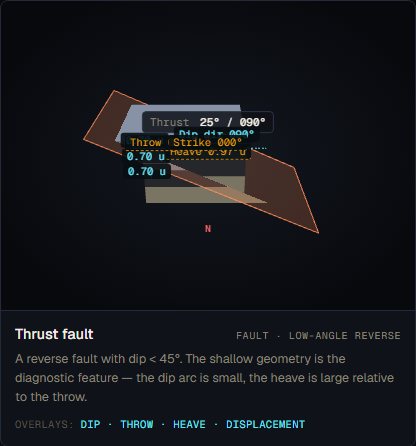
*Screenshot to be captured in Phase A.2.*

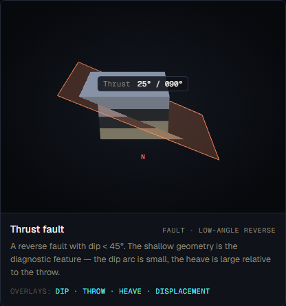
*Screenshot to be captured in Phase A.2.*

### Textbook reference visualisations

**Source 1 — LibreTexts Geosciences: Physical Geology (Earle) §12.3**

URL: https://geo.libretexts.org/Bookshelves/Geology/Physical_Geology_(Earle)/12:_Geological_Structures/12.03:_Fracturing_and_Faulting

Expected content: Thrust fault example — McConnell Thrust in the Rockies. Shows a very shallow dipping plane with large horizontal displacement relative to vertical throw. Text: "a special type of reverse fault with a very low-angle fault plane." HW labelled as an "allochthon" or upper plate.

*Source: LibreTexts Geosciences, "Physical Geology" (Earle), §12.3, accessed 2026-05-18*

**Source 2 — Wikipedia: Fault (geology) — Thrust fault**

URL: https://en.wikipedia.org/wiki/Fault_(geology)#Thrust_fault

Expected content: Thrust fault described as having "dip of the fault plane at less than 45°." Diagram shows shallow-angle plane with HW sheet overriding FW. Fault-bend fold geometry often shown in association.

*Source: Wikipedia, "Fault (geology)" — Thrust fault section, accessed 2026-05-18*

### Accuracy assessment

| Axis | Assessment | Notes |
|---|---|---|
| Geometry | ✓ matches | 25° dip correctly categorises this as a thrust (< 45°). Large heave relative to throw (0.97 vs 0.45) is geometrically correct and visually diagnostic. `upDipVec` used for HW motion. The fault plane nearly horizontal — consistent with textbook thrust geometry. |
| Measurement overlays | ⚠ partial | Throw and heave correctly shown. The `displacement` entry in the overlays array in geo-data.jsx suggests this formation was intended to show net displacement — but the builder code does not call a displacement overlay function. The geo-data overlays list is metadata only; the actual rendering is driven by `addThrowHeaveOverlay` which renders throw+heave but not net displacement. This is a discrepancy between stated and actual behaviour. |
| Labels and terminology | ⚠ partial | "Thrust 25° / 090°" label is correct. Throw and heave labelled. No HW/FW block labels. The distinction between thrust and reverse is purely by dip angle (25° < 45°) — the visual distinction is the shallow dip arc and the large heave label, which are present. This is a useful pedagogical feature. No label explaining WHY this is a thrust and not a reverse fault. |
| Misconception risk | ✗ reinforces | Same §3.4 misconceptions: no HW/FW labels, no displacement. Additionally: the threshold between reverse and thrust (45°) is not shown or explained anywhere in the scene. A student viewing both formations must infer the distinction from the dip angles alone. A labelled "dip < 45° = thrust" annotation would close this gap. No stress-state badge. |
| Default parameters | ✓ | 25° dip is well within thrust range and is a realistic value (e.g., McConnell Thrust ~25°). The DEFAULTS table gives `thrust: 25` — formation uses exactly this value. Stated dip, inferred throw and heave. |

### Severity rating

**Rating:** `misleading`

The geometry is correct and the throw/heave contrast (large heave, small throw) is the correct visual diagnostic for a thrust. However, the absent HW/FW labels and absent displacement label reinforce §3.4 misconceptions. Additionally, the `displacement` overlay is listed in the geo-data metadata but not actually rendered — a discrepancy that means the stated pedagogical goal (showing displacement) is not achieved.

### Required v2 work

1. **Add HW/FW labels (spec-v2 §5.2 — required).** Same as normal/reverse faults.
2. **Add sense-of-motion arrows on fault plane (spec-v2 §5.2 — required).** HW arrow pointing up-dip (very shallow angle — nearly horizontal); FW arrow pointing down-dip.
3. **Add net displacement as a labelled overlay (spec-v2 §5.2 — required).** The geo-data overlays array already lists `displacement` as an overlay, but the builder does not render it. Implement the displacement line in `buildFaultScene` for `subtype === 'thrust'`.
4. **Add stress-state badge (spec-v2 §5.2 — required).** "COMPRESSION" pill, same as reverse fault.
5. **Add "thrust boundary" annotation (spec-v2 §5.2 — optional but recommended).** A small label or tooltip explaining "Thrust faults dip < 45°; reverse faults dip ≥ 45°" to close the reverse/thrust distinction gap.
6. **Add stratigraphic age badges (spec-v2 §5.1 — required).**

### Notes

- The `displacement` field in the overlays list of geo-data.jsx is listed as `['dip', 'throw', 'heave', 'displacement']` — this inconsistency with the normal and reverse fault (which list `['dip', 'throw', 'heave', 'datum-reconstruction']`) suggests the thrust was intended to show displacement but the renderer was not updated to match.
- The thrust correctly enforces the reverse/thrust boundary (dip < 45°) by the value choice alone. v1 does not enforce this boundary programmatically; the distinction relies entirely on the data entry. v2 should consider a runtime assertion or UI warning if a "thrust" is assigned a dip ≥ 45°.

---

## Faults: Strike-slip (Dextral)

**v1 reference ID:** `strike-slip-dextral`
**Source files involved:** `three-helpers.jsx` — `buildFaultScene()` (`subtype === 'strike-slip'`, `sense === 'dextral'` path), `geo-data.jsx` — `REFERENCE_FORMATIONS['strike-slip-dextral']`

### Source-code reading summary

- Builder function: `buildFaultScene()` in `three-helpers.jsx`
- REFERENCE_FORMATIONS entry: `geo-data.jsx` → `REFERENCE_FORMATIONS['strike-slip-dextral']`
- Key parameters: `dip: 90`, `strike: 0` (N–S), `sense: 'dextral'`, `displacement: 1.0`. Three layers: sandstone/shale/limestone (0.6/0.7/0.6 u). Camera: `{ phi: 1.4, theta: 0.0, dist: 9 }`.
- Known deviations: Strike-slip path uses `strikeVec(strike) × sign × displacement` for slip vector. Sign = +1 for dextral. Strike 0° = north bearing. HW (positive-normal side of a vertical plane) moves north.

**What is rendered:**
1. Block split at 90°/090° (vertical N–S plane); HW (east block) translated 1.0 u northward.
2. Translucent vertical fault plane quad; outline.
3. Floating label: "Strike-slip dextral 000°" (strike bearing).
4. `addStrikeSlipOverlay` renders: two tick marks on either side of the datum — FW side pre-motion tick (static), HW side post-motion tick (offset 1.0 u north). Dashed purple pre-motion HW tick. Arrow from pre-motion to post-motion HW position, labelled "1.00 u dextral". Compass rose at top. Strike line + "Strike 000°" label.
5. Layer thickness arrows on FW side.

**What is NOT rendered:**
- No HW / FW labels.
- No sense-of-motion arrows ON the fault plane surface (only offset ticks on a datum, and an arrow offset from the plane).
- No stress-state badge ("SHEAR" / lateral motion).
- No plan-view (map-view) representation — the dominant textbook presentation for strike-slip faults is plan view.
- No "throw" or "heave" (correct — strike-slip has neither vertical throw nor heave by definition).
- No stratigraphic age badges.

**Critical camera issue:** Camera is at `{ phi: 1.4, theta: 0.0, dist: 9 }`. With `theta = 0.0`, the camera sits due south of the scene, looking north. The fault strikes N–S (strike 0°) — the camera is looking directly along the fault strike. The fault plane therefore appears as a vertical line, and the north-directed slip arrow on the HW block points directly toward or away from the camera (nearly depth-aligned), causing severe foreshortening. A student cannot determine dextral vs sinistral sense from this view without rotating the camera. The sinistral formation uses an identical camera hint, compounding the confusion.

### v1 visualisation

> Placeholder — to be populated by A.2.

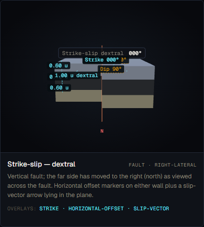
*Screenshot to be captured in Phase A.2.*

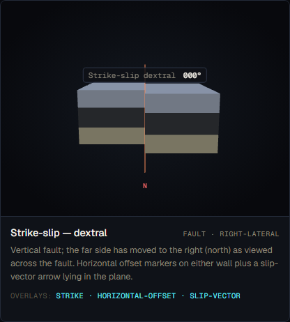
*Screenshot to be captured in Phase A.2.*

### Textbook reference visualisations

**Source 1 — Wikipedia: Fault (geology) — Strike-slip fault**

URL: https://en.wikipedia.org/wiki/Fault_(geology)#Strike-slip_fault

Expected content: Plan-view (map view) diagram of a strike-slip fault showing two blocks displaced laterally. Dextral: standing on one block and facing the fault, the opposite block moves right. The plan-view clearly shows the relative displacement without requiring the observer to rotate. Fault plane near-vertical ("usually near vertical" per Wikipedia).

*Source: Wikipedia, "Fault (geology)" — Strike-slip fault section, accessed 2026-05-18*

**Source 2 — LibreTexts Geosciences: Physical Geology (Earle) §12.3**

URL: https://geo.libretexts.org/Bookshelves/Geology/Physical_Geology_(Earle)/12:_Geological_Structures/12.03:_Fracturing_and_Faulting

Expected content: Strike-slip block diagram (Fig 12.3.5) showing right-lateral and left-lateral variants. Plan view used for clarity of sense determination. Labels identify dextral/sinistral sense explicitly.

*Source: LibreTexts Geosciences, "Physical Geology" (Earle), §12.3, accessed 2026-05-18*

### Accuracy assessment

| Axis | Assessment | Notes |
|---|---|---|
| Geometry | ✓ matches | Vertical (90°) fault plane is correct for strike-slip. East block offset northward by 1.0 u is geometrically correct for dextral (right-lateral) sense on an N–S fault. No throw or heave — correct. |
| Measurement overlays | ⚠ partial | Offset arrow and displacement label ("1.00 u dextral") present. Datum tick markers show pre/post motion correctly. However: the offset arrow is foreshortened by the default camera orientation (looking along strike). A student who does not rotate the camera sees the arrow depth-projected, not its full 1.0 u length. |
| Labels and terminology | ⚠ partial | "Strike-slip dextral 000°" label is correct. Displacement labelled as "1.00 u dextral." Strike labelled with compass rose. No HW/FW labels (for a vertical fault, HW/FW terminology is sometimes considered inapplicable, but the blocks are still identifiable as east and west blocks). |
| Misconception risk | ✗ reinforces | Critical: the camera angle (`theta = 0.0` — looking along strike) means sense of motion is not visually determinable without camera rotation. The slip arrow is foreshortened. Textbooks show strike-slip in plan view precisely so the sense is unambiguous. Without rotating the camera a student cannot confirm dextral vs sinistral. This directly matches the §3.4 confusion risk for strike-slip sense. Additionally: no stress-state badge for lateral shear. |
| Default parameters | ✓ | 90° dip is correct for strike-slip. Displacement 1.0 u is visually prominent. Strike 0° (stated) is geologically reasonable. |

### Severity rating

**Rating:** `misleading`

The geometry is correct but the default camera orientation (`theta = 0.0`) places the observer looking directly along strike. The motion arrow is foreshortened to near-zero apparent length. A student cannot determine dextral vs sinistral from the default view. This is a pedagogical failure for the formation's central purpose. The §3.4 misconception risk rates ✗.

### Required v2 work

1. **Fix default camera orientation (spec-v2 §5.2 — required, high priority).** Change `theta` to approximately `π/2` (1.57 rad) so the camera views the fault from the side (looking west or east) — or better, use a near-overhead oblique (`phi ≈ 0.5, theta ≈ 0.4`) to give a plan-like view that clearly shows the lateral offset. The textbook standard for strike-slip is plan view or oblique overhead.
2. **Add plan-view inset (spec-v2 §5.2 — recommended).** A small 2D plan-view overlay (minimap) showing the map trace and arrows indicating dextral sense, so the student can relate the 3D block to the standard map-view representation.
3. **Add HW/FW or block identity labels (spec-v2 §5.2 — required).** For vertical faults, label the east and west (or north and south) blocks, and note which block moved in which direction.
4. **Add stress-state badge (spec-v2 §5.2 — required).** "LATERAL SHEAR" pill indicating strike-slip stress regime.
5. **Add stratigraphic age badges (spec-v2 §5.1 — required).**

### Notes

- The `addStrikeSlipOverlay` function places the offset arrow and ticks using the normal-direction offset from the fault plane — the tick marks are drawn at `planeN × 1.4` distance from the fault. With `theta = 0.0`, these ticks are at positions that project into the screen depth, making them nearly invisible without rotation.
- The label "Strike-slip dextral 000°" in the floating label is correct. The overlay label "1.00 u dextral" correctly identifies the sense — but is only readable after camera rotation.

---

## Faults: Strike-slip (Sinistral)

**v1 reference ID:** `strike-slip-sinistral`
**Source files involved:** `three-helpers.jsx` — `buildFaultScene()` (`subtype === 'strike-slip'`, `sense === 'sinistral'` path), `geo-data.jsx` — `REFERENCE_FORMATIONS['strike-slip-sinistral']`

### Source-code reading summary

- Builder function: `buildFaultScene()` in `three-helpers.jsx`
- REFERENCE_FORMATIONS entry: `geo-data.jsx` → `REFERENCE_FORMATIONS['strike-slip-sinistral']`
- Key parameters: `dip: 90`, `strike: 0`, `sense: 'sinistral'`, `displacement: 0.9`. Three layers: sandstone/shale/limestone (0.6/0.7/0.6 u). Camera: `{ phi: 1.4, theta: 0.0, dist: 9 }` — same as dextral.
- Known deviations: Sign = -1 for sinistral. HW (east block) moves south (-Z direction). Geometry is correct.

**What is rendered:**
Identical to dextral, but the HW block offset is southward (0.9 u), the offset arrow points south, and the label reads "0.90 u sinistral." Same camera (`theta = 0.0`) — same foreshortening issue.

**What is NOT rendered:** Same list as dextral. The sinistral formation is a near-clone of the dextral formation with only `sense` and `displacement` differing.

**Additional distinguishability concern:** With the same camera hint for both dextral and sinistral (`theta = 0.0`), both formations appear nearly identical from the default view — the only difference is the offset arrow direction, which is foreshortened in both cases. A student switching between the two formations side-by-side cannot reliably tell them apart from the default camera.

### v1 visualisation

> Placeholder — to be populated by A.2.

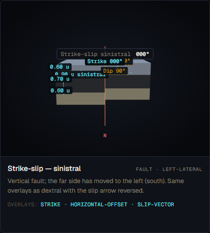
*Screenshot to be captured in Phase A.2.*

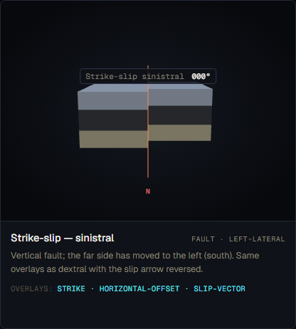
*Screenshot to be captured in Phase A.2.*

### Textbook reference visualisations

**Source 1 — Wikipedia: Fault (geology) — Strike-slip fault**

URL: https://en.wikipedia.org/wiki/Fault_(geology)#Strike-slip_fault

Expected content: Plan-view diagram. Sinistral: standing on one block facing the fault, the opposite block moves left. Clearly distinguishable from dextral in plan view.

*Source: Wikipedia, "Fault (geology)" — Strike-slip fault section, accessed 2026-05-18*

**Source 2 — Geological Digressions: Fault Terminology**

URL: https://www.geological-digressions.com/faults-some-common-terminology/

Expected content: Strike-slip schematic shown "with the fault plane facing the observer such that the block on the far side of the fault moves right or left." Sinistral and dextral visually distinguished by block offset direction in plan view.

*Source: Geological Digressions, "Faults — some common terminology," accessed 2026-05-18*

### Accuracy assessment

| Axis | Assessment | Notes |
|---|---|---|
| Geometry | ✓ matches | Vertical fault, east block moves south (−Z). Sign convention (`evt.sense === 'sinistral' ? -1 : 1`) is correctly applied. Geometry is correct for left-lateral motion. |
| Measurement overlays | ⚠ partial | Offset arrow and label ("0.90 u sinistral") correct and present. Same foreshortening problem as dextral — arrow is depth-aligned at default camera. |
| Labels and terminology | ⚠ partial | "Strike-slip sinistral 000°" label correct. Displacement labelled. No block identity labels. |
| Misconception risk | ✗ reinforces | Same camera problem as dextral — motion arrow foreshortened at `theta = 0.0`. Worse: at default view, sinistral and dextral are visually nearly indistinguishable without rotation, directly undermining the formation's purpose of distinguishing the two senses. No stress-state badge. |
| Default parameters | ✓ | 90° dip and 0.9 u displacement are appropriate. |

### Severity rating

**Rating:** `misleading`

Identical issues to dextral: the camera orientation makes sense-of-motion indeterminate without rotation. Compounded by the fact that sinistral and dextral share the same camera hint, making them visually indistinguishable by default. The misconception risk axis rates ✗.

### Required v2 work

1. **Fix default camera orientation (spec-v2 §5.2 — required, high priority).** Same fix as dextral: change `theta` to show the fault from the side or use an overhead oblique view. The same camera change should be applied to both sinistral and dextral formations.
2. **Ensure sinistral/dextral are visually distinguishable at default view (spec-v2 §5.2 — required).** After the camera fix, verify that the two formations differ visibly without rotation.
3. **Add block identity labels and stress-state badge (spec-v2 §5.2 — required).** Same as dextral.
4. **Add stratigraphic age badges (spec-v2 §5.1 — required).**

### Notes

- The only geometric difference between `strike-slip-dextral` and `strike-slip-sinistral` is the sign of the slip vector and the displacement magnitude (1.0 vs 0.9 u). The slightly different displacement magnitude means the offset marker gap will differ in size — a subtle visual cue. This is insufficient without a clearly readable arrow direction.
- For v2, the two strike-slip formations could share a single enhanced scene with both arrows shown simultaneously, plus a "COMPARE DEXTRAL / SINISTRAL" toggle — a more effective teaching device than two separate scenes.

---

## Faults: Oblique-slip Fault

**v1 reference ID:** `oblique-slip`
**Source files involved:** `three-helpers.jsx` — `buildFaultScene()` (`subtype === 'oblique'` path), `geo-data.jsx` — `REFERENCE_FORMATIONS['oblique-slip']`

### Source-code reading summary

- Builder function: `buildFaultScene()` in `three-helpers.jsx`
- REFERENCE_FORMATIONS entry: `geo-data.jsx` → `REFERENCE_FORMATIONS['oblique-slip']`
- Key parameters: `dip: 65`, `dip_direction: 90` (east), `strike: 0`, `throw: 0.55`, `displacement: 1.05`, `rake: 50` (stored but NOT READ by renderer), `sense`: absent from data entry.
- Known deviations:
  - **Critical: `sense` field absent from geo-data.jsx entry.** The renderer code (`evt.sense === 'sinistral' ? -1 : 1`) defaults to `+1` (dextral) when `sense` is undefined. The description says "moved north ~0.9 units" — this is consistent with dextral sense on a N–S fault (north = positive strike direction). The geometry is incidentally correct, but the sense is implicit and undocumented in the data.
  - **`rake` field present in data but never read by the renderer.** `rake: 50` stored in the event JSON but `evt.rake` is never referenced in `three-helpers.jsx`. The rake angle (angle of the slip vector within the fault plane, measured from the strike direction) is the canonical textbook parameter for oblique-slip classification — its presence in the data but absence from rendering is a data/renderer mismatch.
  - Horizontal component computed as `sqrt(displacement² - (throw/sin(dip))²) ≈ 0.89 u`. The description says "~0.9 units" — consistent.

**What is rendered:**
1. Block split at 65°/090°; HW translated by combined slip vector (down-dip + northward).
2. Translucent fault plane quad; outline.
3. Floating label: "Oblique 65° / 090°".
4. `addThrowHeaveOverlay` renders throw and heave (via `heaveV = abs(slipVec.x) + abs(slipVec.z)` — a simplification; strictly `sqrt(slipVec.x² + slipVec.z²)`, though for a simple N–S fault these differ only when both x and z are non-zero).
5. Slip vector arrow (total displacement) from origin, labelled "Slip 1.05 u".
6. Slip decomposition: vertical arm (throw component, purple arrow), horizontal arm (offset component, purple arrow). Labels: "throw 0.55 u" and "offset N u".
7. Dip arc overlay; compass rose; strike line.

**What is NOT rendered:**
- No HW / FW labels.
- No sense-of-motion arrows on the fault plane (only a decomposition diagram from the origin, not arrows on the plane surface).
- No rake angle annotation (neither the `rake: 50` data value nor a computed arc).
- No stress-state badge.
- No stratigraphic age badges.
- The sense (dextral) of the strike-slip component is not explicitly labelled; a student must infer it from the offset arrow direction.

### v1 visualisation

> Placeholder — to be populated by A.2.

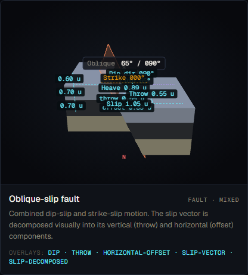
*Screenshot to be captured in Phase A.2.*

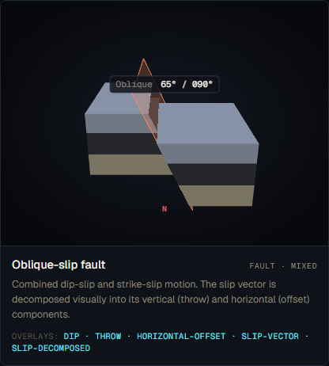
*Screenshot to be captured in Phase A.2.*

### Textbook reference visualisations

**Source 1 — Geological Digressions: Fault Terminology**

URL: https://www.geological-digressions.com/faults-some-common-terminology/

Expected content: Oblique-slip schematic showing "combinations of dip-slip and strike-slip displacement." The observer faces the fault plane to determine the sense of each component. Classification uses compound terminology: dextral-normal, dextral-reverse, sinistral-normal, sinistral-reverse. Rake angle shown within the fault plane from the strike direction to the slip vector.

*Source: Geological Digressions, "Faults — some common terminology," accessed 2026-05-18*

**Source 2 — Wikipedia: Fault (geology) — Oblique-slip fault**

URL: https://en.wikipedia.org/wiki/Fault_(geology)#Oblique-slip_fault

Expected content: Oblique-slip fault shown as a combination of dip-slip and strike-slip. The net displacement vector shown within the fault plane. Rake angle (measured from horizontal within the fault plane) distinguishes predominantly dip-slip (rake near 90°) from predominantly strike-slip (rake near 0°) oblique faults. The section notes oblique faults may be further classified as dextral-normal, dextral-reverse, sinistral-normal, or sinistral-reverse.

*Source: Wikipedia, "Fault (geology)" — Oblique-slip fault section, accessed 2026-05-18*

### Accuracy assessment

| Axis | Assessment | Notes |
|---|---|---|
| Geometry | ⚠ partial | Combined dip-slip + strike-slip slip vector is geometrically correct. The 65° dip and computed horizontal component (~0.89 u) are plausible. However, the `sense` field is absent from the data entry; the renderer defaults to dextral silently. The geometry is incidentally correct per the description, but the data model does not explicitly document the oblique fault's full kinematic classification (rake and sense). |
| Measurement overlays | ⚠ partial | The slip decomposition (vertical throw arm + horizontal offset arm with labels) is present and is the key diagnostic feature — this is the correct way to visualise oblique-slip decomposition. However: (a) the rake angle is not shown as an arc within the fault plane; (b) the compound classification (e.g. "dextral-normal") is not labelled; (c) net displacement vector in the fault plane is shown from the origin rather than anchored to a real piercing point on a datum layer. |
| Labels and terminology | ✗ wrong | The `rake: 50` data field is present but the renderer ignores it entirely — `evt.rake` is never read in `three-helpers.jsx`. The rake angle is the canonical textbook parameter for classifying oblique-slip faults (rake 10°–80° = oblique; rake near 0° = strike-slip; rake near 90° = dip-slip). Its presence in the data suggests an intent to use it that was never implemented. The compound classification (e.g. "dextral-normal oblique") is absent from the label. The `sense` field is absent from the data, causing a silent default. |
| Misconception risk | ✗ reinforces | No HW/FW labels. No rake annotation. No compound classification label. The sense of the strike-slip component is implicit (defaults to dextral via code fallback). A student viewing this formation cannot identify: (1) which component (dip-slip or strike-slip) dominates; (2) the full kinematic classification; (3) which block is the hanging wall. |
| Default parameters | ⚠ partial | 65° dip is plausible for an oblique fault. Rake 50° (stored but unused) gives a roughly equal mix of dip-slip and strike-slip, which is a sensible default for a "mixed" case. However, since rake is unused, the actual rendered geometry is derived from throw and displacement independently — the two are numerically consistent but the rake parameter serves no function. |

### Severity rating

**Rating:** `misleading`

The slip decomposition overlay (the key pedagogical feature for oblique-slip) is implemented and present. However, the `rake` field is stored but never rendered, the `sense` field is absent from data causing a silent code default, and neither the rake angle nor the compound classification is shown. The labels and terminology axis rates ✗ due to the rake/sense mismatch. The misconception risk axis also rates ✗.

### Required v2 work

1. **Implement rake angle overlay in the fault plane (spec-v2 §5.2 — required).** Draw an arc within the fault plane from the strike direction to the slip vector, labelled with the rake angle in degrees. This is the canonical textbook parameter for oblique-slip and is already stored in the data.
2. **Add `sense` field to the oblique-slip data entry (spec-v2 §5.2 — required).** The current entry relies on a silent code default. Add `sense: 'dextral'` to `geo-data.jsx` to make the intent explicit and prevent ambiguity.
3. **Add compound classification label (spec-v2 §5.2 — required).** Show the full classification (e.g. "Dextral-normal oblique") in the floating label or as a subtitle.
4. **Add HW/FW labels (spec-v2 §5.2 — required).** Same as other fault formations.
5. **Add stress-state badge (spec-v2 §5.2 — required).** A mixed-mode badge, e.g. "OBLIQUE (compression + shear)."
6. **Add stratigraphic age badges (spec-v2 §5.1 — required).**

### Notes

- The `heaveV` computation in `addThrowHeaveOverlay` uses `Math.abs(slipVec.x) + Math.abs(slipVec.z)` rather than `Math.sqrt(slipVec.x² + slipVec.z²)`. For this formation (north–south strike, east dip), `slipVec.x` is the east–west component and `slipVec.z` is the north–south (strike) component. Both are non-zero for oblique slip. The L1 norm (sum of absolutes) differs from the L2 norm (Euclidean magnitude) when both components are non-zero. This means the rendered heave label slightly overstates the true horizontal magnitude. This is a minor computational error in the overlay.
- The `rake: 50` value in the data corresponds to `atan2(throw_in_plane / horiz_comp) ≈ atan2(0.55/sin(65°) / 0.89) ≈ atan2(0.607/0.89) ≈ 34°` — which does not match the stored `rake: 50`. This inconsistency further confirms that the rake field is decorative/aspirational and was never used to drive the geometry.

---

## Faults: Listric Fault

**v1 reference ID:** `listric-fault`
**Source files involved:** `three-helpers.jsx` — `buildFaultScene()` (`subtype === 'listric'` path, `isListric = true`), `three-helpers.jsx` — `solveCircularArc()`, `addListricDipAnnotations()`, `geo-data.jsx` — `REFERENCE_FORMATIONS['listric-fault']`

### Source-code reading summary

- Builder function: `buildFaultScene()` in `three-helpers.jsx`; dedicated sub-functions `solveCircularArc()` and `addListricDipAnnotations()`
- REFERENCE_FORMATIONS entry: `geo-data.jsx` → `REFERENCE_FORMATIONS['listric-fault']`
- Key parameters: `dip: 70` (surface), `dip_at_depth: 10`, `detachment_depth: 3.0`, `throw: 1.0`, `dip_direction: 90` (east), `strike: 0` (stated). Three layers: upper unit/middle unit/lower unit (1.0/1.0/1.5 u), each with explicit colours. Camera: `{ phi: 1.05, theta: 0.0, dist: 10 }`.
- Known deviations: The listric path uses a dedicated `solveCircularArc()` function that computes the circular-arc cross-section profile. The arc spans from surface dip (70°) to detachment dip (10°) at 3.0 m depth. The block split uses the same plane-clipping approach as other faults (approximated by surface dip), not the full curved split. This means the block boundary in 3D is a flat plane, not a curved surface — the curved fault surface is rendered as a visual overlay only, while the block offset mechanics use a flat-plane approximation.

**What is rendered:**
1. Block split by flat plane at 70°/090° (surface dip approximation). HW translated by `downDipVec(70°, 90°) × (throw/sin(70°))`.
2. **Curved fault surface** — a tessellated mesh extruded along strike from the circular-arc profile, rendered at opacity 0.25. Profile trace line as overlay.
3. Surface dip overlay: horizontal disc + dip arc + label "Dip 70°" at the surface intersection point.
4. Depth dip overlay: horizontal disc + dip arc + label "Dip @ depth 10°" at the detachment point.
5. Detachment depth annotation: dashed vertical line + double-arrow from surface to detachment, labelled "Detachment depth: N m".
6. Floating label: "Listric 70° / 090°".
7. Layer thickness arrows on FW side.

**What is NOT rendered:**
- No HW / FW labels.
- The curved fault surface is rendered but the **detachment surface is not rendered as a distinct horizontal plane** with a label. The arc ends at the detachment point but there is no horizontal "decollement" plane shown beyond that point — students will see the arc terminating without a clear indication of the low-angle detachment surface extending laterally.
- No rollover fold in the hanging wall (geologically expected but beyond v1 scope — noted for context only).
- No sense-of-motion arrows.
- No stress-state badge ("EXTENSION").
- No stratigraphic age badges.
- The block mechanics (flat-plane clip) do not match the rendered curved surface — the HW block face is cut by a flat plane while the fault surface appears curved. This creates a visible geometric mismatch between the cut block geometry and the curved fault surface.

### v1 visualisation

> Placeholder — to be populated by A.2.

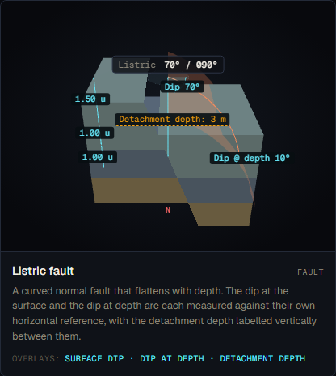
*Screenshot to be captured in Phase A.2.*

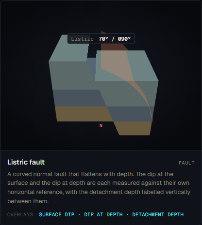
*Screenshot to be captured in Phase A.2.*

### Textbook reference visualisations

**Source 1 — Wikipedia: Fault (geology) — Listric fault**

URL: https://en.wikipedia.org/wiki/Fault_(geology)#Listric_fault

Expected content: Diagram of a listric fault with concave-upward profile, steep at surface, flattening to a decollement (detachment surface). HW shows rollover fold (antiformal structure in hanging wall). Detachment surface clearly labelled. The article states: "The fault planes of listric faults can further flatten and evolve into a horizontal or near-horizontal plane, where slip progresses horizontally along a decollement."

*Source: Wikipedia, "Fault (geology)" — Listric fault section, accessed 2026-05-18*

**Source 2 — Geological Digressions: Fault Terminology**

URL: https://www.geological-digressions.com/faults-some-common-terminology/

Expected content: Listric fault diagrams showing "concave upward fault surfaces" that flatten "at depth in a detachment surface." Two settings: crustal-scale (Basin and Range style) and delta-top (gravity-driven). Detachment surface shown as a distinct horizontal-to-sub-horizontal plane at the base of the listric arc.

*Source: Geological Digressions, "Faults — some common terminology," accessed 2026-05-18*

### Accuracy assessment

| Axis | Assessment | Notes |
|---|---|---|
| Geometry | ⚠ partial | The curved fault surface arc geometry (`solveCircularArc`) is mathematically correct — a circular arc from 70° surface dip to 10° depth dip at 3.0 m. The visual representation of the curved fault surface is correct. HOWEVER: the block clipping uses a flat plane at the surface dip angle (70°), not the full curved surface. The HW block face is cut flat while the fault surface is curved. This mismatch is visible — the curved fault surface and the flat block boundary diverge below the surface. A student who notices this may conclude that listric faults have flat planes, which is the opposite of the defining characteristic. |
| Measurement overlays | ⚠ partial | Surface dip (70°) and dip-at-depth (10°) overlays are present and correctly anchored. Detachment depth annotation is present. This is the correct set of measurements for a listric fault. However: no horizontal detachment plane is shown extending from the arc terminus — the detachment is implicit (arc ends at a point) rather than explicit (a labelled horizontal surface). |
| Labels and terminology | ⚠ partial | "Listric 70° / 090°" label is correct. Dip at surface and dip at depth labelled. "Detachment depth: N m" labelled. However: the detachment surface itself is not labelled as a "decollement" or "detachment surface" — only its depth is measured. The absence of the detachment plane as a distinct labelled entity is a significant terminology gap. |
| Misconception risk | ✗ reinforces | The flat-plane block clipping vs curved surface mismatch risks teaching students that listric faults have a flat block boundary at the surface dip. The detachment surface is not shown as a distinct horizontal plane with a label — students may not understand that the key geometric consequence is a near-horizontal decollement. No HW/FW labels. No rollover fold (geologically expected but v1-scope). No extension badge. |
| Default parameters | ✓ | Surface dip 70° and detachment dip 10° are realistic (Basin-and-Range style listric normal faults commonly steepen from ~25° at surface to flat detachment, but values of 70° surface / 10° depth are not unrealistic for the upper crust). Detachment depth 3.0 m in model units (scaled to the layer stack) is proportionate. |

### Severity rating

**Rating:** `misleading`

The curved fault surface is implemented and the dip-at-surface / dip-at-depth / detachment-depth overlays are correct. However, the block clipping uses a flat plane approximation that visually contradicts the curved fault surface — the defining geometric feature of a listric fault. Additionally, the detachment surface (decollement) is not rendered as a labelled horizontal plane, only as an annotated depth. These gaps and the mismatch risk reinforcing misconceptions about listric fault geometry. The geometry axis rates ⚠ and the misconception risk axis rates ✗.

### Required v2 work

1. **Implement curved block clipping (spec-v2 §5.2 — required, high priority).** Replace the flat-plane clip with a curved surface clip that matches the rendered arc profile. Without this, the HW block face is cut by a flat plane that diverges from the curved fault surface — the two visual elements contradict each other.
2. **Add explicit detachment surface plane (spec-v2 §5.2 — required).** Render a translucent horizontal (or sub-horizontal) plane at the detachment depth, extending laterally beyond the arc terminus. Label it "Detachment surface (decollement)." This directly addresses the "what is the listric fault flattening into?" question.
3. **Add HW/FW labels (spec-v2 §5.2 — required).** Same as other fault formations.
4. **Add sense-of-motion arrow on fault surface (spec-v2 §5.2 — required).** An arrow along the curved surface in the dip direction, showing the HW moving down and eastward.
5. **Add stress-state badge (spec-v2 §5.2 — required).** "EXTENSION" pill — listric faults are extensional normal faults.
6. **Add stratigraphic age badges (spec-v2 §5.1 — required).**
7. **Consider rollover fold (spec-v2 §5.2 — optional).** The hanging wall antiform (rollover fold) is a direct geometric consequence of listric faulting and is present in most textbook diagrams. Implementing a simplified rollover fold would significantly increase the formation's pedagogical value.

### Notes

- The `solveCircularArc` function is mathematically well-implemented (bisection algorithm to find the arc radius that places the detachment point at the specified depth). The geometry solver is correct; the rendering issue is in the block-clipping step, not the arc computation.
- `detachment_depth` is marked as "inferred" in field_origin. This is the correct designation — in the field, detachment depth is rarely directly measured; it is inferred from seismic reflection profiles or structural reconstruction.
- The curved surface `fpMesh` and the flat-plane block clip create an inconsistency that is visible when overlays are turned off. This is the most visually prominent issue in the entire listric fault formation.
