# Fold and Layer Formations Audit
*Audited by Phase A.4 (folds-layers group)*
*Auditor branch: phase-a4-folds-layers*

---

## Folds: Anticline

**v1 reference ID:** `anticline`
**Source files involved:** `three-helpers.jsx` — `buildFoldScene()` (handles all fold subtypes; anticline path is `subtype === 'anticline'`), `geo-data.jsx` — `REFERENCE_FORMATIONS['anticline']`

---

### Source-code reading summary

**What `geo-data.jsx` says the model contains:**

```json
{
  "id": "anticline",
  "layers": [
    { "id": "L1", "name": "Sandstone", "lithology": "sandstone", "thickness": 0.55, "order": 0 },
    { "id": "L2", "name": "Shale",     "lithology": "shale",     "thickness": 0.55, "order": 1 },
    { "id": "L3", "name": "Limestone", "lithology": "limestone", "thickness": 0.55, "order": 2 }
  ],
  "events": [
    {
      "id": "O1", "type": "fold", "subtype": "anticline",
      "axis_strike": 0, "plunge": 12, "plunge_direction": 0,
      "interlimb_angle": 100, "amplitude": 1.0, "wavelength": 4.5
    }
  ]
}
```

Key data-layer observations:
- Three equal-thickness layers (0.55 u each; total 1.65 u). `order` is present in the JSON but is not rendered as a visible badge on the layer faces — no age annotation exists anywhere in the fold renderer.
- Plunge 12° north — non-zero; this is the default configuration. BUG-03 would be worst at `plunge: 0` but even at 12° the non-zero plunge is modest and students can still be confused.
- Anticline and syncline use **identical layer colours** (sandstone/shale/limestone) with **identical layer thicknesses** — the only structural difference between the two rendered scenes is that the anticline arches **up** and the syncline arches **down**, encoded by `sign = subtype === 'syncline' ? -1 : 1` applied to the cosine amplitude.
- At plunge 0° (which `todo.md` describes as the pedagogically worst case) the two scenes would be mirror reflections of each other with no distinguishing label or colour.

**What `buildFoldScene()` actually renders for `subtype === 'anticline'`:**

1. **Fold surface.** Three tessellated layer slabs (top and bottom surfaces, four side strips each). Shape: `foldHeight(x) = amplitude * Math.cos((π·x)/(λ/2))` with `sign = +1`. At x=0 the crest is at `y = total/2 + amplitude = 1.65/2 + 1.0 = 1.825 u` above the scene centre. Geometry is a smooth cosine arch — textbook-correct shape.

2. **Plunge rotation.** The entire group is quaternion-rotated so the fold axis points along `plungeDir = 0°` (north) plunged at `12°`. This correctly reproduces the V-shaped outcrop pattern a student would see in map view.

3. **Hinge line.** A coloured line along the crest (axisTarget direction, length ≈ 4.5 u), labelled `"hinge line"` in a muted grey value-label. Correct position and label.

4. **Axial plane.** A translucent `PlaneGeometry` quad (width = total + 0.6 = 2.25 u, length = 4.5 u) rendered at `opacity: 0.18` in `COLOR.axial`. The plane is correctly oriented (YZ in fold-local frame, rotated to world by the plunge quaternion). **However, the axial plane carries no text label** — it is a translucent surface only. A student cannot confirm from the scene that this plane is the "axial plane" without prior knowledge.

5. **Interlimb arc.** Arc drawn between the two limb direction vectors at λ/4 from the hinge, labelled `"Interlimb N°"`. The computed interlimb angle uses `limbL · limbR` on the actual rendered limb vectors, so it reflects the true geometry rather than the stored value. Correct.

6. **Plunge overlay.** Horizontal reference disc + compass rose + two arrows (horizontal projection vs. plunged axis) + arc labelled `"Plunge 12° → 000°"`. Correct.

7. **Fold label.** Floating HTML label reads `"Anticline · 12° → 000°"`. Subtype name is present.

8. **What is NOT rendered for the anticline:**
   - No stratigraphic age badges on layer faces. The `order` field (0 = oldest, 2 = youngest) exists in the data but nothing in `buildFoldScene()` draws numbered badges or any age indicator.
   - No axial plane text label (the translucent surface is present but unlabelled).
   - No younging direction arrow.
   - No "oldest rock in core" callout.

---

### v1 visualisation

> **Placeholder — to be populated by A.2.**

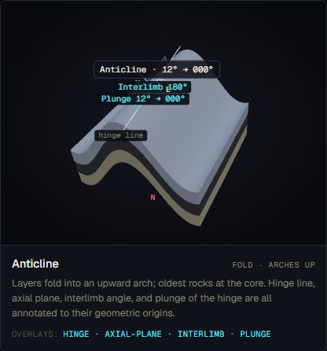
*Screenshot to be captured in Phase A.2.*

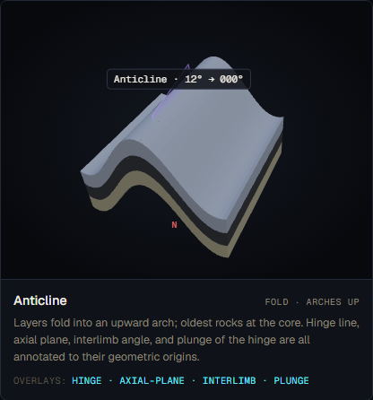
*Screenshot to be captured in Phase A.2.*

---

### Textbook reference visualisations

> **Placeholder — to be populated by A.2.**

**Source 1 — LibreTexts Geosciences (Johnson et al.), §9.4: Folds**

*Reference image to be downloaded in A.2*

URL: https://geo.libretexts.org/Bookshelves/Geology/Book:_An_Introduction_to_Geology_(Johnson_Affolter_Inkenbrandt_and_Mosher)/09:_Crustal_Deformation_and_Earthquakes/9.04:_Folds

Expected content (Fig 9.4.1): Anticline block diagram with axial plane and hinge line labelled; oldest beds at core explicitly marked; limbs dipping away symmetrically; axial plane is a labelled translucent surface, not an unlabelled translucent quad.

*Source: LibreTexts Geosciences, "An Introduction to Geology" (Johnson et al.), §9.4, accessed 2026-05-18*

**Source 2 — Wikipedia: Anticline**

*Reference image to be downloaded in A.2*

URL: https://en.wikipedia.org/wiki/Anticline

Expected content: Cross-section diagram showing convex-upward arch, oldest beds at eroded core, dip-direction arrows on limbs. Wikipedia article explicitly states that distinguishing anticline from syncline requires checking which rock unit is oldest at the core — a criterion absent from v1.

*Source: Wikipedia, "Anticline", accessed 2026-05-18*

---

### Accuracy assessment

| Axis | Assessment | Notes |
|---|---|---|
| Geometry | ✓ matches | Cosine-arch fold with `sign = +1` correctly produces an upward arch. Amplitude 1.0 u (0.61× total stack height) is a textbook-like gentle open fold. Default plunge 12° north is a mild but non-zero plunge — geometry is recognisable. |
| Measurement overlays | ⚠ partial | Hinge line (labelled), interlimb arc (labelled), and plunge arc (labelled) are all present and geometrically correct. The axial plane surface is present but **carries no text label** — students cannot confirm what the translucent quad represents. The axial plane label is the first missing item spec-v2 §5.4 must add. |
| Labels and terminology | ⚠ partial | Floating label reads "Anticline · 12° → 000°" — correct terminology, subtype is named. Hinge is labelled. Axial plane surface exists but is not labelled "axial plane." No layer-age callout ("oldest" / "youngest") anywhere. |
| Misconception risk | ✗ reinforces | BUG-03 (spec-v2 §3.4): "Anticline and syncline are distinguished by shape alone." v1 anticline and syncline are rendered with **identical layer colours, identical thickness ratios, and the only structural difference being vertical direction of arch.** At `plunge = 0` (which `todo.md` explicitly flags) the two scenes are indistinguishable to a student who flips the camera. Even at the default 12° plunge, no age annotation distinguishes the two — a student cannot verify "oldest in core" from the visualisation. The todo.md and spec-v2 §3.4 both document this as a confirmed misconception risk. |
| Default parameters | ⚠ partial | Plunge 12° is non-zero, which is pedagogically better than zero plunge for the BUG-03 case. However, `todo.md` notes the reported worst case is `plunge = 0`; the default should arguably be higher (≥15°) or the age annotation should be present before zero-plunge is safe. Interlimb 100° is typical of an open fold. Amplitude 1.0 u is reasonable. |

---

### Severity rating

**Rating:** `misleading`

**Justification:**

The anticline geometry is textbook-correct: the arch is upward, the hinge line is labelled, the interlimb arc is drawn, and the plunge overlay is accurate. The formation is not actively wrong.

However, BUG-03 — the documented misconception that "anticline and syncline are distinguished by shape alone" (spec-v2 §3.4, confirmed in `todo.md`) — is unaddressed. The two fold types share identical layer colours and the sole rendered distinction (arch up vs. arch down) will be ambiguous whenever students change the camera angle. No age annotation or axial-plane label distinguishes the two. The `Geological Digressions` source (ref. file `geological-digressions-fold-terminology.txt`) explicitly states that anticline/syncline is a stratigraphic term (oldest/youngest in core), not a geometric one — v1 teaches the geometric version only.

The missing axial-plane text label is a secondary issue (the surface exists, it just isn't labelled). The missing age annotation is the primary risk.

The misconception risk axis rates ✗, placing this formation at `misleading`.

---

### Required v2 work

1. **Add stratigraphic age badges to layer faces (spec-v2 §5.1 — required).**
   Numbered badges (1 = oldest, N = youngest) on the visible side faces of each layer. For the anticline: sandstone L1/order-0 = oldest = badge "1"; limestone L3/order-2 = youngest = badge "3". This directly addresses BUG-03 by making "oldest in core" legible from the rendered scene without prior knowledge.

2. **Add axial-plane text label (spec-v2 §5.4 — required, BUG-03 FIX).**
   The existing translucent axial-plane quad should carry a text label "ANTICLINE — axial plane" along its top edge (per spec-v2 §5.4). This label survives camera rotation and makes the fold type unambiguous even at zero plunge.

3. **Add younging direction arrow (spec-v2 §5.1 — required).**
   A vertical arrow on the right side of the model labelled "YOUNGING ↑" pointing toward younger rocks. In an anticline this points outward (away from the core) on both limbs — the arrow on the fold cross-section should capture this.

---

### Notes

- **BUG-03 confirmation from source code.** Line 952 in `three-helpers.jsx`: `const sign = subtype === 'syncline' ? -1 : 1`. This single sign flip is the only code difference between the anticline and syncline renderers. All layer colours, all overlay colours, and all geometry are otherwise identical. The bug is structurally confirmed.
- **Plunge default.** The default plunge of 12° in `geo-data.jsx` partially mitigates BUG-03 (the plunge direction label reads "000°" for anticline vs. "180°" for syncline) but does not resolve it — a student who rotates the camera to a top-down view still sees an identical pattern in both cases.
- **Antiform vs anticline.** The `Geological Digressions` source flags that "anticline" is technically a stratigraphic term (oldest in core) while "antiform" is geometric (arch up). GeoForge uses "anticline" correctly in intent but fails to render the stratigraphic evidence that justifies the term.

---

## Folds: Syncline

**v1 reference ID:** `syncline`
**Source files involved:** `three-helpers.jsx` — `buildFoldScene()` (syncline path is `subtype === 'syncline'`), `geo-data.jsx` — `REFERENCE_FORMATIONS['syncline']`

---

### Source-code reading summary

**What `geo-data.jsx` says the model contains:**

```json
{
  "id": "syncline",
  "layers": [
    { "id": "L1", "name": "Sandstone", "lithology": "sandstone", "thickness": 0.55, "order": 0 },
    { "id": "L2", "name": "Shale",     "lithology": "shale",     "thickness": 0.55, "order": 1 },
    { "id": "L3", "name": "Limestone", "lithology": "limestone", "thickness": 0.55, "order": 2 }
  ],
  "events": [
    {
      "id": "O1", "type": "fold", "subtype": "syncline",
      "axis_strike": 0, "plunge": 8, "plunge_direction": 180,
      "interlimb_angle": 110, "amplitude": 1.0, "wavelength": 4.5
    }
  ]
}
```

Key data-layer observations:
- **Identical layer stack** to the anticline (same lithology names, same colours, same thickness 0.55 u × 3). No age badges.
- Plunge 8° south (`plunge_direction: 180`) — slightly lower than the anticline default (12°), plunging in the opposite direction. The plunge direction difference is the only visible label that distinguishes the two at the default camera angle.
- The sole rendering difference from the anticline is `sign = -1`, giving `foldHeight(x) = -amplitude * cos(...)` — a trough instead of an arch.

**What `buildFoldScene()` actually renders for `subtype === 'syncline'`:**

All points are identical to the anticline description above except:

1. **Fold surface.** The cosine function yields a trough (`sign = -1`), so the hinge is at the bottom of the fold and the limbs dip inward toward the centre.
2. **Hinge line.** Correctly placed at the trough rather than the crest.
3. **Axial plane.** Present, translucent, unlabelled — exactly as for the anticline.
4. **Fold label.** `"Syncline · 8° → 180°"` — plunge direction is south (180°), contrasting with anticline's north (0°).
5. **What is NOT rendered:** Same omission list as anticline. No age badges, no axial-plane text label, no younging arrow, no "youngest in core" callout.

---

### v1 visualisation

> **Placeholder — to be populated by A.2.**

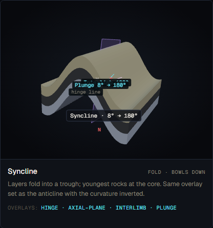
*Screenshot to be captured in Phase A.2.*

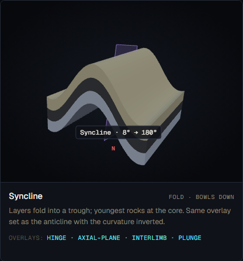
*Screenshot to be captured in Phase A.2.*

---

### Textbook reference visualisations

> **Placeholder — to be populated by A.2.**

**Source 1 — LibreTexts Geosciences (Johnson et al.), §9.4: Folds**

*Reference image to be downloaded in A.2*

Expected content (Denver Basin cross-section, Fig 9.4.6): Syncline schematic showing youngest rocks at core; limb dip directions indicated; axial plane labelled; youngest/oldest designations present. Direct contrast with the anticline diagram.

*Source: LibreTexts Geosciences, "An Introduction to Geology" (Johnson et al.), §9.4, accessed 2026-05-18*

**Source 2 — Lumen Learning: Reading Folds**

*Reference image to be downloaded in A.2*

Expected content: Sideling Hill syncline road-cut photograph and accompanying block diagram. Syncline V-pattern in plunging fold shown alongside anticline V-pattern — the two are distinguishable in the Lumen Learning reference by the youngest-in-core labelling, not by shape alone.

*Source: Lumen Learning, "Reading: Folds" (Geology), accessed 2026-05-18*

---

### Accuracy assessment

| Axis | Assessment | Notes |
|---|---|---|
| Geometry | ✓ matches | Cosine-trough fold with `sign = -1` correctly produces a downward arch (trough). Amplitude 1.0 u, wavelength 4.5 u, interlimb 110° — all reasonable. Default plunge 8° south is non-zero. |
| Measurement overlays | ⚠ partial | Same as anticline: hinge line (labelled), interlimb arc (labelled), plunge overlay (labelled) are present and correct. Axial plane surface is present but unlabelled. |
| Labels and terminology | ⚠ partial | Floating label "Syncline · 8° → 180°" is correct. Hinge is labelled. Axial plane surface is unlabelled. No age annotation. |
| Misconception risk | ✗ reinforces | BUG-03 applies identically to the syncline as to the anticline. The only code difference from the anticline renderer is `sign = -1` (line 952 of `three-helpers.jsx`). At zero plunge, flipping the camera makes the syncline and anticline visually indistinguishable. At the default 8° south plunge the plunge label reads "180°" vs. the anticline's "000°", which is a weak distinguishing cue but not sufficient — a student could confuse a south-plunging anticline with a north-plunging syncline without age annotation. The "youngest in core" rule (the textbook definition of syncline) is entirely absent from the rendered scene. |
| Default parameters | ⚠ partial | Plunge 8° (weaker than the anticline's 12°) is marginally better than zero but represents a minimal mitigation. The todo.md confirms this is a known issue. Interlimb 110° is slightly wider than the anticline's 100° — a subtle difference unlikely to be pedagogically significant at the default camera distance. |

---

### Severity rating

**Rating:** `misleading`

**Justification:**

The syncline geometry is correct (trough shape, textbook-valid parameters). The severity is identical to the anticline: BUG-03 is confirmed for both fold types simultaneously. Without age annotation the "youngest in core" definition of a syncline is invisible to the student. The `Geological Digressions` source explicitly flags that syncline/syncform confusion arises precisely when younging direction is absent. The misconception risk axis rates ✗.

---

### Required v2 work

1. **Add stratigraphic age badges to layer faces (spec-v2 §5.1 — required).**
   Same as anticline. For the syncline: sandstone L1/order-0 = oldest = badge "1" on the outermost limb exposure; limestone L3/order-2 = youngest = badge "3" at the trough core. Makes "youngest in core" legible.

2. **Add axial-plane text label (spec-v2 §5.4 — required, BUG-03 FIX).**
   Label "SYNCLINE — axial plane" along the top edge of the axial-plane quad.

3. **Add younging direction arrow (spec-v2 §5.1 — required).**
   For a syncline the younging arrow points inward toward the core on each limb (opposing directions on the two limbs). The right-side younging arrow should point downward toward the trough in the cross-section view.

---

### Notes

- **BUG-03 direct confirmation.** The only code difference between anticline and syncline is `const sign = subtype === 'syncline' ? -1 : 1` (line 952). This is a single-character rendering distinction with no label or annotation consequence.
- **Plunge-direction asymmetry.** Anticline plunges 12° north, syncline plunges 8° south. This is a deliberate choice by the v1 author (confirmed by `description_source` text in `geo-data.jsx`). The different plunge directions produce a slightly different floating label but do not address the core BUG-03 issue.
- **Synform vs syncline terminology.** The Geological Digressions source distinguishes these: a synform is a geometric trough; a syncline is a synform with youngest rocks in the core. v1 labels the scene "Syncline" without rendering the evidence that justifies that label. This is a direct pedagogical gap.

---

## Folds: Monocline

**v1 reference ID:** `monocline`
**Source files involved:** `three-helpers.jsx` — `buildFoldScene()` (monocline path is `subtype === 'monocline'`), `geo-data.jsx` — `REFERENCE_FORMATIONS['monocline']`

---

### Source-code reading summary

**What `geo-data.jsx` says the model contains:**

```json
{
  "id": "monocline",
  "layers": [
    { "id": "L1", "name": "Sandstone", "lithology": "sandstone", "thickness": 0.5, "order": 0 },
    { "id": "L2", "name": "Shale",     "lithology": "shale",     "thickness": 0.5, "order": 1 },
    { "id": "L3", "name": "Limestone", "lithology": "limestone", "thickness": 0.5, "order": 2 }
  ],
  "events": [
    {
      "id": "O1", "type": "fold", "subtype": "monocline",
      "axis_strike": 0, "flexure_dip": 35, "flexure_width": 1.2, "step_height": 0.9
    }
  ]
}
```

Key data-layer observations:
- Three equal-thickness layers (0.5 u each; total 1.5 u). No age badges as with folds above.
- `step_height: 0.9` (0.6× total stack height) — a significant structural step that should be clearly visible.
- `flexure_dip: 35°` — the panel dip is realistic (real monoclines range 10°–90°; classic Colorado Plateau monoclines are 30°–60°). This is a stated value.
- No `plunge` in the monocline event — the monocline has a `plunge` overlay guard at `opt.plunge !== false && plunge > 0.01 && subtype !== 'monocline'`, meaning the plunge overlay is **explicitly disabled** for monocline. This is correct — a monocline is not defined by plunge.

**What `buildFoldScene()` actually renders for `subtype === 'monocline'`:**

1. **Fold surface.** `foldHeight(x)` uses a smoothstep function: `return -h * t²(3-2t)` where `t = (x + w/2)/w`. This correctly renders: flat upper platform at `h=0`, smooth S-curve flexure over width `w=1.2 u`, flat lower platform at `h=-0.9 u`. The geometry is the correct "flat–flex–flat" monocline pattern described in the caption.

2. **Flexure dip overlay.** `addDipOverlay()` called at the top of the flexure zone with `dipDeg = 35`, `dipDir = 90` (east, derived as `(axisStrike + 90) % 360`). Strike line, dip arc, dip-direction arc, and compass rose are all rendered. Correct.

3. **Flexure width annotation.** A double-headed arrow spanning the flexure panel from `-w/2` to `+w/2`, labelled `"Flexure 1.20 u"`. Correct.

4. **Plunge overlay.** Explicitly disabled for monocline (`subtype !== 'monocline'` guard). Correct — a monocline is not characterised by a hinge plunge.

5. **Axial plane.** Explicitly disabled for monocline (same guard: `opt.axial !== false && subtype !== 'monocline'`). This is correct — the standard monocline mnemonic does not feature an axial plane in the same way as anticline/syncline.

6. **Interlimb arc.** Explicitly disabled for monocline. Correct — interlimb angle is not a standard monocline measurement.

7. **Hinge line.** The code draws the hinge line for all subtypes (no `subtype !== 'monocline'` guard at line 1082). The hinge line is positioned at `foldHeight(0)`, which for the monocline is `-h * 0.5^2 * (3 - 2*0.5) = -h * 0.75 = -0.675 u` — this places the hinge in the middle of the flexure zone, which is geometrically correct.

8. **Underlying step indicator.** Per spec-v2 §5.4, v2 should add a faint dashed line showing the underlying structural "step" the monocline drapes over (the standard mnemonic: a carpet over a stair). **This is absent from v1.** The smooth-step surface is rendered but the step itself is not indicated.

9. **What is NOT rendered for the monocline:**
   - No underlying step indicator (dashed line below the flexure showing the controlling fault or basement step).
   - No stratigraphic age badges on layer faces.
   - No younging direction arrow.
   - No label distinguishing the upper flat panel from the lower flat panel.

---

### v1 visualisation

> **Placeholder — to be populated by A.2.**

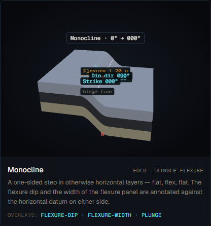
*Screenshot to be captured in Phase A.2.*

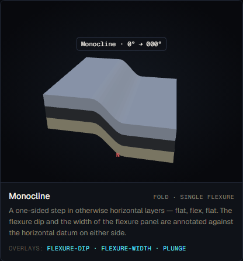
*Screenshot to be captured in Phase A.2.*

---

### Textbook reference visualisations

> **Placeholder — to be populated by A.2.**

**Source 1 — LibreTexts Geosciences (Johnson et al.), §9.4: Folds**

*Reference image to be downloaded in A.2*

Expected content (Fig 9.4.4 — Water Pocket Fold monocline aerial photo, Capitol Reef NP): One-sided flexure with flat upper platform, dipping panel, and flat lower platform. The controlling thrust-fault step is visible at depth in outcrop cross-sections accompanying the photo. This is the standard two-panel monocline geometry.

*Source: LibreTexts Geosciences, "An Introduction to Geology" (Johnson et al.), §9.4, accessed 2026-05-18*

**Source 2 — Lumen Learning: Geologic Structures**

*Reference image to be downloaded in A.2*

Expected content: Block diagram of monocline showing the step-over geometry, with the "underlying step" controlling fault visible at the base. The step mnemonic is the pedagogical hook for monoclines.

*Source: Lumen Learning, "Geologic Structures" (Physical Geography), accessed 2026-05-18*

---

### Accuracy assessment

| Axis | Assessment | Notes |
|---|---|---|
| Geometry | ✓ matches | Smoothstep function correctly renders the flat–flex–flat monocline pattern. Step height 0.9 u (60% of total layer thickness) is clearly visible. Flexure dip 35° is realistic. The geometry is texbook-accurate (matches Capitol Reef NP field geometry in LibreTexts Fig 9.4.4). |
| Measurement overlays | ✓ | Flexure dip overlay (strike, dip arc, dip-direction, compass rose) and flexure width double-arrow are both present and correctly placed. All overlay values reflect the actual rendered geometry. |
| Labels and terminology | ⚠ partial | Floating label "Monocline · 0° → 000°" correctly names the type. Hinge line is labelled. Flexure annotations are labelled. Upper/lower platform panels are **not** labelled as "upper flat" / "lower flat" — a minor omission but not misleading. The underlying step indicator (the controlling basement fault or monocline "stair") is absent. |
| Misconception risk | ⚠ subtle | The smoothstep surface correctly renders the monocline shape, but the **underlying step indicator** is absent. The step mnemonic (a carpet draped over a stair, with the controlling structure visible at depth) is standard pedagogy (spec-v2 §5.4). Without it, a student may not understand *why* the monocline has this shape — they see a smooth flexure but cannot infer the structural control. This is a missed pedagogical opportunity rather than an active misconception, so it rates ⚠ rather than ✗. Age annotation is also absent, but for a monocline (which is not defined by age-in-core) this is less critical than for anticline/syncline. |
| Default parameters | ✓ | Flexure dip 35° (stated), step height 0.9 u, flexure width 1.2 u. These are realistic for a teaching example. The step height (0.9 u out of 1.5 u total) makes the asymmetry clearly visible. |

---

### Severity rating

**Rating:** `minor-confusion`

**Justification:**

The monocline geometry is correct and all core overlays (flexure dip, flexure width, hinge line) are present and correctly labelled. The formation does not share the BUG-03 misconception risk of anticline/syncline — a monocline is visually distinct from both by its asymmetric one-sided geometry.

The missing underlying step indicator is the main gap. Per spec-v2 §5.4 this is a required addition in v2, but it represents a missed teaching opportunity rather than an active error or likely misconception. A student will learn the correct shape of a monocline from v1 but may not understand its structural cause.

Missing age annotation is a universal gap (it rates `misleading` for folds where age-in-core is diagnostic); for the monocline it rates at most `minor-confusion` because the type is not defined by age sequence.

Worst axis is Misconception risk at ⚠, giving `minor-confusion`.

---

### Required v2 work

1. **Add underlying step indicator (spec-v2 §5.4 — required).**
   A faint dashed line (or translucent box) below the flexure zone indicating the controlling structural step. Label it "controlling step (basement fault)." This is the standard monocline mnemonic ("a carpet over a stair") and is explicitly listed in spec-v2 §5.4.

2. **Add stratigraphic age badges to layer faces (spec-v2 §5.1 — required for all layer-bearing formations).**
   Although age-in-core is not the defining feature of a monocline, the general age-annotation requirement from §5.1 applies. Numbered badges on layer faces.

---

### Notes

- **Smoothstep choice.** The renderer uses a cubic smoothstep (`t²(3-2t)`) rather than a sinusoidal ramp. Smoothstep produces a slightly more S-shaped flexure than a pure cosine ramp. Both are acceptable simplifications of real monocline geometry; the choice does not introduce a misconception.
- **No axial-plane or interlimb for monocline.** The guards `subtype !== 'monocline'` at lines 1101 and 1119 are correct — monoclines do not have a conventional interlimb angle or prominent axial plane in standard pedagogy.
- **Hinge line position.** At `x = 0` (mid-flexure), `foldHeight(0) = -h * 0.25 * 2 = -h * 0.5 = -0.45 u` from the flat upper datum. This places the hinge at the inflection point of the smoothstep, which is geometrically accurate.

---

## Layers: Horizontal strata

**v1 reference ID:** `horizontal-strata`
**Source files involved:** `three-helpers.jsx` — `buildLayersOnly()` (no fold/fault event; `tilt.dip = 0`), `geo-data.jsx` — `REFERENCE_FORMATIONS['horizontal-strata']`

---

### Source-code reading summary

**What `geo-data.jsx` says the model contains:**

```json
{
  "id": "horizontal-strata",
  "layers": [
    { "id": "L1", "name": "Sandstone", "lithology": "sandstone", "thickness": 1.2, "order": 0 },
    { "id": "L2", "name": "Shale",     "lithology": "shale",     "thickness": 0.9, "order": 1 },
    { "id": "L3", "name": "Limestone", "lithology": "limestone", "thickness": 1.5, "order": 2 },
    { "id": "L4", "name": "Mudstone",  "lithology": "mudstone",  "thickness": 0.6, "order": 3 }
  ],
  "events": [],
  "tilt": { "strike": 0, "dip": 0, "dip_direction": 0 }
}
```

Key data-layer observations:
- Four layers, varying thickness (1.2/0.9/1.5/0.6 u; total 4.2 u). The layer thickness variation makes individual beds distinguishable.
- `tilt.dip = 0` — completely horizontal, as expected.
- `order` values 0–3 are present in the JSON but are not rendered as visible badges anywhere in `buildLayersOnly()`.

**What `buildLayersOnly()` actually renders:**

1. **Layer block.** `layerBlock()` builds a `BoxGeometry` for each layer slab, coloured by lithology. The block is 4.2 u wide × 4.2 u deep. With `dipDeg = 0` the stack is perfectly horizontal — no tilt rotation is applied.

2. **Block edges.** `blockEdges()` adds thin edge lines around the block perimeter. This helps define the layer boundaries.

3. **Thickness overlay.** Since `overlayOpts?.thickness !== false`, thickness vectors are drawn for every layer. A double-headed arrow (`doubleArrow`) connects the top and bottom surfaces at the layer mid-edge, labelled with the thickness value (e.g. "1.20 u"). This is the primary overlay for this formation.

4. **Layer name labels.** `makeLabel(s.L.name)` is called for each slab, positioned on the right side face of each layer. So "Sandstone", "Shale", "Limestone", "Mudstone" are visible as floating HTML labels.

5. **Strike/dip overlays.** The guard `if (dipDeg > 0.01 && model.overlayOpts?.tilt !== false)` ensures no strike/dip annotation is drawn when dip is zero. Correct — horizontal beds have no meaningful strike or dip.

6. **What is NOT rendered:**
   - No stratigraphic age badges (order 0–3 in data, not rendered).
   - No younging direction arrow.
   - No layer age annotation of any kind.

---

### v1 visualisation

> **Placeholder — to be populated by A.2.**

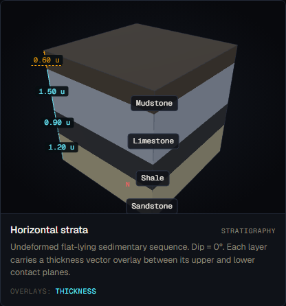
*Screenshot to be captured in Phase A.2.*

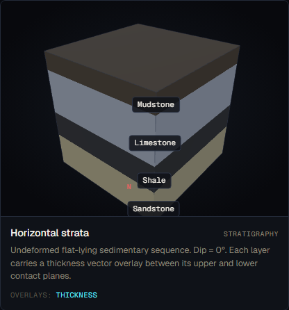
*Screenshot to be captured in Phase A.2.*

---

### Textbook reference visualisations

> **Placeholder — to be populated by A.2.**

**Source 1 — LibreTexts Geosciences (Waldron & Snyder) — Primary Structures**

*Reference image to be downloaded in A.2*

URL: https://geo.libretexts.org/Bookshelves/Geology/Geological_Structures_-_A_Practical_Introduction_(Waldron_and_Snyder)/01:_Topics/1.03:_Primary_Structures

Expected content: Block diagrams of horizontal bedding, with lithology colours distinguishing units and layer thickness annotations. Standard horizontal-strata reference for verifying GeoForge's thickness overlay placement.

*Source: LibreTexts Geosciences, "Geological Structures: A Practical Introduction" (Waldron & Snyder), §1.3, accessed 2026-05-18*

**Source 2 — Lumen Learning: Geologic Structures**

*Reference image to be downloaded in A.2*

URL: https://courses.lumenlearning.com/suny-geophysical/chapter/geologic-structures/

Expected content: Horizontal strata block diagram with layered sequence visible in cross-section. Multi-layer stack with individual unit colours.

*Source: Lumen Learning, "Geologic Structures" (Physical Geography, SUNY), accessed 2026-05-18*

---

### Accuracy assessment

| Axis | Assessment | Notes |
|---|---|---|
| Geometry | ✓ matches | A horizontal four-unit stack with varying thickness is the canonical example in both the Waldron & Snyder and Lumen Learning references. No tilt is applied. Block edges are visible. |
| Measurement overlays | ✓ | Thickness double-arrows are drawn per layer, labelled with value in units. Arrow placement (at the layer mid-edge) is geometrically correct — it connects the upper and lower contact planes perpendicular to bedding (which coincides with vertical for horizontal strata). |
| Labels and terminology | ⚠ partial | Layer name labels ("Sandstone", "Shale", etc.) are present. However, no age annotation (numbered badges, age ramp, younging arrow) is present. For a single four-layer sequence, the stratigraphic order is implied by vertical position (bottom = oldest), but this is not made explicit. A student who does not already know "older is lower in an undisturbed sequence" will not learn this from the visualisation. |
| Misconception risk | ⚠ subtle | The standard misconception for horizontal strata is that students assume the oldest layer is always at the bottom regardless of tectonic history — this is Steno's principle of superposition. v1 renders horizontal strata correctly (oldest at bottom for undisturbed sequence) but does not label the age or explain superposition. The risk is subtle: a student could correctly read the diagram but for the wrong reason (shape-reading rather than stratigraphic principle). The absence of age annotation is a universal gap (see spec-v2 §5.1), but for a single undisturbed sequence it is less dangerous than for folded sequences. |
| Default parameters | ✓ | Dip 0° correct. Four layers with varying thickness (1.2/0.9/1.5/0.6 u) produces a realistic sedimentary stack. Lithology sequence (sandstone base, shale, limestone, mudstone top) is geologically coherent. |

---

### Severity rating

**Rating:** `minor-confusion`

**Justification:**

The geometry is textbook-correct. The thickness overlays work. Layer names are present. The missing age annotation (no numbered badges, no younging arrow) is a universal gap that rates `minor-confusion` for single undisturbed sequences where the "oldest at bottom" rule is at least geometrically implicit. The risk is lower here than for folded sequences where the relationship between shape and age is non-obvious. Misconception risk axis rates ⚠.

---

### Required v2 work

1. **Add stratigraphic age badges to layer faces (spec-v2 §5.1 — required).**
   Numbered badges (1 = oldest, N = youngest) on visible side faces. For this four-layer stack: mudstone L4/order-3 = youngest = "4" at top, sandstone L1/order-0 = oldest = "1" at base. Implements Steno's superposition principle visually.

2. **Add younging direction arrow (spec-v2 §5.1 — required).**
   A "YOUNGING ↑" arrow on the right side, pointing upward (for undisturbed horizontal sequence). This makes the principle explicit.

---

### Notes

- **Thickness overlay field_origin.** L4 (Mudstone) has `field_origin: { thickness: 'inferred' }`. The renderer correctly renders L4's thickness arrow in the inferred (dashed-amber) style. This is a correctly implemented distinction.
- **Layer naming.** The layer name labels are placed using `makeLabel()` on the right side face. This is visible at the default camera angle but may overlap with the thickness overlay at close zoom. No issue identified.

---

## Layers: Dipping strata

**v1 reference ID:** `dipping-strata`
**Source files involved:** `three-helpers.jsx` — `buildLayersOnly()` with `tilt.dip = 30`, `geo-data.jsx` — `REFERENCE_FORMATIONS['dipping-strata']`

---

### Source-code reading summary

**What `geo-data.jsx` says the model contains:**

```json
{
  "id": "dipping-strata",
  "layers": [
    { "id": "L1", "name": "Sandstone", "lithology": "sandstone", "thickness": 1.0, "order": 0 },
    { "id": "L2", "name": "Shale",     "lithology": "shale",     "thickness": 0.8, "order": 1 },
    { "id": "L3", "name": "Limestone", "lithology": "limestone", "thickness": 1.0, "order": 2 }
  ],
  "events": [],
  "tilt": {
    "strike": 0, "dip": 30, "dip_direction": 90,
    "field_origin": { "strike": "stated", "dip": "stated", "dip_direction": "stated" }
  }
}
```

Key data-layer observations:
- Three layers, total 2.8 u. Dip 30° east. All field_origin values are `stated`.
- `overlays: ['strike', 'dip', 'dip-direction']` — all three measurement overlays present.

**What `buildLayersOnly()` renders for `dipping-strata`:**

1. **Layer block.** Three-layer box stack, then rotated about the strike axis by `-rad(30)` to produce a 30°-east dip. Geometry is correct.

2. **Thickness overlays.** Drawn per layer at the tilted-frame mid-edge position. Since `overlayOpts?.thickness` is not explicitly set false in the dipping-strata entry, the thickness arrows also appear. The thickness arrows are drawn perpendicular to bedding in the tilted frame (the `blockToWorld` quaternion is applied correctly). This is the correct measurement of true thickness.

3. **Strike/dip overlay** (`addDipOverlay()`). Applied because `dipDeg > 0.01`. The overlay draws:
   - Horizontal reference disc at the top-face centre of the tilted block.
   - Compass rose.
   - Strike line labelled "Strike 000°".
   - Dip-direction arc labelled "Dip dir 090°".
   - Dip arc labelled "Dip 30°".
   All field_origin values are `stated`, so overlays render in the standard (non-inferred) style.

4. **Layer name labels.** Present on right side faces (same as horizontal-strata).

5. **What is NOT rendered:**
   - No age badges (universal gap).
   - No younging arrow.
   - No strike-and-dip symbol (the T-shaped field geology symbol used on maps) — the overlays show the measurement values but not the standard map symbol. This is a minor distinction; the arc-based overlays are pedagogically equivalent.

---

### v1 visualisation

> **Placeholder — to be populated by A.2.**

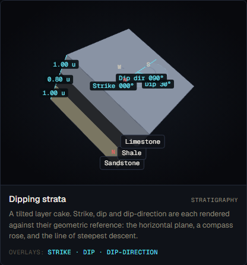
*Screenshot to be captured in Phase A.2.*

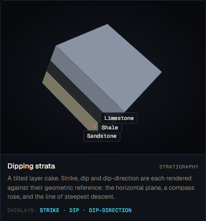
*Screenshot to be captured in Phase A.2.*

---

### Textbook reference visualisations

> **Placeholder — to be populated by A.2.**

**Source 1 — LibreTexts Geosciences (Waldron & Snyder) — Primary Structures**

*Reference image to be downloaded in A.2*

Expected content: Strike-and-dip notation diagrams for tilted beds. Block diagrams showing dipping strata with the strike line (horizontal direction on the dipping surface) and dip arrow (steepest descent direction). Correct placement of the standard T-symbol on map views.

*Source: LibreTexts Geosciences, "Geological Structures: A Practical Introduction" (Waldron & Snyder), §1.3, accessed 2026-05-18*

**Source 2 — Lumen Learning: Geologic Structures**

*Reference image to be downloaded in A.2*

Expected content: Tilted strata block diagram with apparent and true thickness distinguishable by viewing angle. Strike-and-dip annotation visible.

*Source: Lumen Learning, "Geologic Structures" (Physical Geography, SUNY), accessed 2026-05-18*

---

### Accuracy assessment

| Axis | Assessment | Notes |
|---|---|---|
| Geometry | ✓ matches | Three-layer stack tilted 30°/090° (east). This is the canonical dipping-strata geometry in both the Waldron & Snyder and Lumen Learning references. The tilt rotation is applied correctly about the strike axis. |
| Measurement overlays | ✓ | Strike (000°), dip (30°), and dip-direction (090°) are all rendered with correct arc geometry. All three field_origin values are `stated`, so no amber-dashed treatment. The dip arc is anchored at the top-face centre of the tilted block — the correct geometric vertex. Thickness perpendicular-to-bedding arrows are also drawn correctly in the tilted frame. |
| Labels and terminology | ✓ | Strike, dip, and dip-direction labels all use accepted terminology. Layer name labels are present. The floating caption identifies the formation as "Dipping strata." |
| Misconception risk | ⚠ subtle | Same universal gap as horizontal-strata: no age annotation. For dipping strata the implication that the lower layer is always older still holds (an undisturbed tilted sequence) but is not labelled. Also absent: apparent vs. true thickness distinction — students who examine the block from different angles may confuse apparent width with true thickness. The thickness arrows correctly show true perpendicular thickness, but apparent thickness (width as seen in map view up-dip) is not called out. This is a minor teaching gap. |
| Default parameters | ✓ | Dip 30° east is a realistic and commonly used textbook example (30° is standard for "gentle to moderate dip"). Strike 000° (north–south) is arbitrary but reasonable. Three layers with different lithology colours (sandstone/shale/limestone) provide clear visual differentiation. |

---

### Severity rating

**Rating:** `minor-confusion`

**Justification:**

The geometry and all three measurement overlays are correct. The formation is a good teaching example. The only gaps are the universal missing age annotation and the absence of an apparent-vs-true thickness callout. Neither constitutes a likely misconception for this formation — dipping-strata is primarily used to teach strike and dip, and those are correctly rendered. Misconception risk axis rates ⚠ (subtle).

---

### Required v2 work

1. **Add stratigraphic age badges to layer faces (spec-v2 §5.1 — required).**
   Numbered badges on visible side faces, same as all other layer-bearing formations.

2. **Add younging direction arrow (spec-v2 §5.1 — required).**
   "YOUNGING" arrow perpendicular to bedding, pointing toward younger rocks (up-section in the tilted frame).

---

### Notes

- **Apparent vs. true thickness.** The thickness overlay correctly shows true perpendicular thickness. A future enhancement (not strictly required by spec-v2 §5.1 but pedagogically valuable) would annotate apparent thickness in map view alongside true thickness.
- **Strike/dip symbol vs. arc annotation.** The arc-based overlays are not the standard T-symbol used on geological maps, but they are unambiguous and more pedagogically informative. No change required.

---

## Layers: Multi-layer sequence with thickness vectors

**v1 reference ID:** `multilayer-thickness`
**Source files involved:** `three-helpers.jsx` — `buildLayersOnly()` with `tilt.dip = 8`, `geo-data.jsx` — `REFERENCE_FORMATIONS['multilayer-thickness']`

---

### Source-code reading summary

**What `geo-data.jsx` says the model contains:**

```json
{
  "id": "multilayer-thickness",
  "layers": [
    { "id": "L1", "name": "Mudstone",  "lithology": "mudstone",  "thickness": 0.7, "order": 0 },
    { "id": "L2", "name": "Sandstone", "lithology": "sandstone", "thickness": 1.1, "order": 1 },
    { "id": "L3", "name": "Limestone", "lithology": "limestone", "thickness": 0.8, "order": 2 },
    { "id": "L4", "name": "Chalk",     "lithology": "chalk",     "thickness": 0.5, "order": 3 },
    { "id": "L5", "name": "Shale",     "lithology": "shale",     "thickness": 1.0, "order": 4 }
  ],
  "events": [],
  "tilt": { "strike": 0, "dip": 8, "dip_direction": 90 }
}
```

Key data-layer observations:
- Five layers (total 4.1 u). The largest multi-layer reference formation. Mild tilt: dip 8° east.
- `overlays: ['thickness']` — only thickness overlays, not strike/dip/direction. At 8° dip the tilt is present but the strike/dip overlay is still drawn by `buildLayersOnly()` if `dipDeg > 0.01` (which it is at 8°). The `model.overlayOpts?.tilt` condition is not false, so the dip overlay will appear alongside the thickness vectors.
- L4 (Chalk) has `field_origin: { thickness: 'inferred' }` — its arrow will render in the amber/dashed inferred style.
- The caption states this formation's purpose is specifically to teach "perpendicular thickness vector annotated on every layer."

**What `buildLayersOnly()` renders for `multilayer-thickness`:**

1. **Layer block.** Five-layer stack tilted 8° east. Mild tilt, primarily decorative (gives realistic dipping geometry while keeping the scene near-vertical).

2. **Thickness overlays.** All five layers get double-headed perpendicular thickness arrows at the tilted-frame mid-edge. L4 (Chalk) renders in the inferred/amber style. The other four render in the standard overlay style. Values range from 0.50 u (chalk) to 1.10 u (sandstone).

3. **Strike/dip overlay.** Because `dipDeg = 8 > 0.01`, `addDipOverlay()` is called. This produces strike, dip, and dip-direction annotations at the top-face centre — even though the stated `overlays` array for this formation only lists `'thickness'`. The overlay opt guard only disables overlays if `model.overlayOpts?.tilt === false`; since `overlayOpts.tilt` is not set, the dip overlays always appear for any non-zero dip.

4. **Layer name labels.** Present on right side faces for all five layers.

5. **What is NOT rendered:**
   - No age badges (universal gap). For a five-layer sequence the age order is particularly important — a student presented with this scene has no way to determine the stratigraphic order from the visualisation alone, unless they already know that mudstone is older than shale in this sequence (which is context-dependent). This is the most consequential age-annotation gap across all layer formations.
   - No younging arrow.

---

### v1 visualisation

> **Placeholder — to be populated by A.2.**

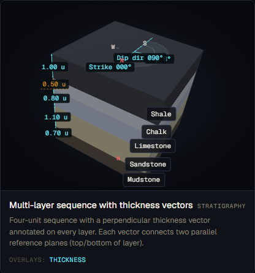
*Screenshot to be captured in Phase A.2.*

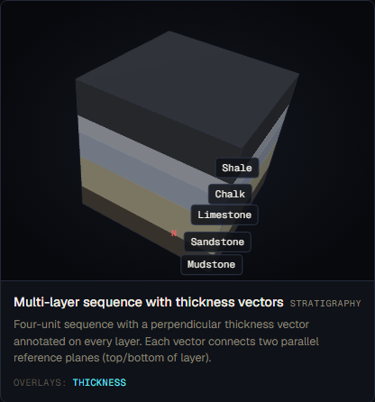
*Screenshot to be captured in Phase A.2.*

---

### Textbook reference visualisations

> **Placeholder — to be populated by A.2.**

**Source 1 — LibreTexts Geosciences (Waldron & Snyder) — Primary Structures**

*Reference image to be downloaded in A.2*

Expected content: Multi-layer block diagrams in both map view and cross-section, with stratigraphic age implied by sequence. Standard reference for multi-layer thickness and stratigraphic order.

*Source: LibreTexts Geosciences, "Geological Structures: A Practical Introduction" (Waldron & Snyder), §1.3, accessed 2026-05-18*

**Source 2 — LibreTexts — Stratigraphy Contacts**

*Reference image to be downloaded in A.2*

URL: https://geo.libretexts.org/Courses/SUNY_Potsdam/Sedimentary_Geology:_Rocks_Environments_and_Stratigraphy/12:_Stratigraphy/12.01:_Review_of_unconformities_and_other_types_of_contacts

Expected content: Conformable multi-layer cross-sections showing parallel bedding with stratigraphic order labelled. Age annotation is present in all reference diagrams for multi-layer sequences.

*Source: LibreTexts Geosciences, "Sedimentary Geology" (SUNY Potsdam), §12.1, accessed 2026-05-18*

---

### Accuracy assessment

| Axis | Assessment | Notes |
|---|---|---|
| Geometry | ✓ matches | Five-layer stack with mild 8° dip. Varying lithology colours and thickness values are clearly distinguishable. Geometry is textbook-accurate. |
| Measurement overlays | ✓ | Five perpendicular thickness arrows, correctly placed in the tilted frame. L4 (Chalk) correctly renders in the inferred style. The incidental strike/dip overlay from the 8° tilt is also present. No incorrect measurements. |
| Labels and terminology | ⚠ partial | Layer name labels are present. No age annotation. For a five-layer sequence, age order is pedagogically critical — the purpose of showing five layers is to teach stratigraphic reading, which requires age. Without badges the sequence is a colour chart, not a stratigraphy lesson. |
| Misconception risk | ✗ reinforces | The multi-layer sequence is the formation most at risk from absent age annotation. A student reading a five-layer stack with no age numbers must assume that "lower = older" — which is only valid for undisturbed sequences. The scene shows a mildly dipping (8°) sequence with no tectonic disturbance, so in this specific case the rule holds. But the absence of any age label means the student must bring the superposition principle themselves. Worse: the lithology sequence (mudstone/sandstone/limestone/chalk/shale) has no natural age mnemonic — if a student asks "which is oldest?" the correct answer (mudstone, L1, order=0) is invisible in the rendered scene. Per spec-v2 §5.1 this is flagged as a `misleading` gap for multi-layer sequences, because the scene's purpose is to teach stratigraphic reading but it withholds the key information needed to read stratigraphy. |
| Default parameters | ✓ | Dip 8° adds visual interest without dominating. Five distinct lithologies with varying thickness (0.5–1.1 u) give a realistic sedimentary package. Chalk (L4) as the inferred-thickness unit is a correct teaching example of measurement uncertainty. |

---

### Severity rating

**Rating:** `misleading`

**Justification:**

The geometry and thickness overlays are correct. The severity is driven by the misconception risk axis (✗): the formation's explicit pedagogical purpose is to teach multi-layer stratigraphic reading, but it omits the stratigraphic age information that makes such reading possible. A student using this card as their primary reference for "how to read a multi-layer sequence" will learn to read thickness and lithology but not age order — which is the most important skill this card should develop. Per spec-v2 §5.1, missing age annotation on multi-layer formations rates `misleading`.

---

### Required v2 work

1. **Add stratigraphic age badges to all five layer faces (spec-v2 §5.1 — required, highest priority for this formation).**
   Numbered badges (1 = oldest, 5 = youngest): mudstone "1", sandstone "2", limestone "3", chalk "4", shale "5" on all visible side faces. The age ramp (dark for old, light for young) should also be applied to side faces per spec-v2 §5.1.

2. **Add younging direction arrow (spec-v2 §5.1 — required).**
   "YOUNGING ↑" arrow pointing in the direction of younger beds (up-section in the tilted frame, which at 8°/090° is approximately up and slightly east).

---

### Notes

- **Implicit tilt overlays.** The 8° dip causes `addDipOverlay()` to fire even though the stated `overlays` for this card are `['thickness']` only. The resulting strike/dip/direction annotation is not incorrect, but it may confuse students who expect this card to focus on thickness. This is a minor UX issue, not a geological error.
- **Chalk as inferred thickness.** L4 (Chalk, 0.5 u) has `field_origin: { thickness: 'inferred' }`. The amber/dashed arrow correctly signals this. This is a good pedagogical use of the inferred-value visual system.
- **Five-layer limit.** This is the only five-layer reference formation. At five layers with age badges the side-face annotation may be visually dense. The v2 design team should confirm the badge sizing can accommodate five distinct numbers at the default camera distance.
