# Intrusion and Unconformity Formations Audit
*Audited by Phase A.4 (intrusions-unconformities group)*
*Auditor branch: phase-a4-intrusions-unconformities*

---

## Intrusions: Dyke

**v1 reference ID:** `dyke-basalt`
**Source files involved:** `src/three-helpers.jsx` — `buildIntrusionGeometry()` (subtype `dyke` path), `src/geo-data.jsx` — `REFERENCE_FORMATIONS['dyke-basalt']`

### Source-code reading summary

- Builder function: `buildIntrusionGeometry()` in `three-helpers.jsx`, `subtype === 'dyke'` branch (lines 1208–1225)
- REFERENCE_FORMATIONS entry: `geo-data.jsx` → `REFERENCE_FORMATIONS['dyke-basalt']`
- Key parameters: `strike: 0`, `dip: 90`, `thickness: 0.4`, `rock_type: 'basalt'`. Layers are flat (`model.tilt` absent = dip 0).
- Known deviations from default geometry: none

**What the builder actually renders:**

1. **Dyke geometry.** A `BoxGeometry(2 * totalHeight, totalHeight, intrusion.thickness)` box, rotated about Y by `-rad(strike)` so it aligns with the stated strike. At `dip: 90` and `strike: 0` this produces a near-vertical N–S slab cutting across the horizontal layer stack. The dyke is correctly discordant — it crosses all three horizontal layers.

2. **Orientation relationship.** The dyke is built as a vertical body independent of any `model.tilt` — it is never rotated to match a tilted host. For the reference formation (flat layers), this is correct: a vertical dyke cuts horizontal beds discordantly. If the host layers were tilted, the dyke would still render vertically, which is geometrically consistent with a discordant body (it does not track host-rock attitude). This is correct behaviour for a dyke.

3. **Measurement overlays.** Strike line, dip arc (from horizontal to vertical at the stated dip), thickness double-arrow, and a floating label `Dyke (basalt)`.

4. **What is NOT rendered:**
   - No cross-cutting age tag ("post-L3" or similar) indicating which layers the dyke post-dates (spec-v2 §5.7, v2 addition — not in v1).
   - No chilled-margin texture or contact feature.
   - No orientation-to-bedding label (e.g. "cuts across bedding — discordant").

### v1 visualisation

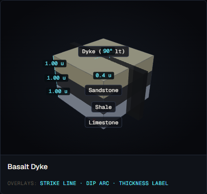
*Screenshot to be captured in Phase A.2.*

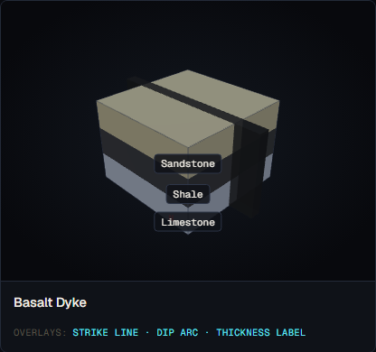
*Screenshot to be captured in Phase A.2.*

### Textbook reference visualisations

**Source 1 — LibreTexts Geosciences (Earle): Intrusive Igneous Bodies**

*Reference image to be downloaded in A.2*

URL: https://geo.libretexts.org/Bookshelves/Geology/Physical_Geology_(Earle)/03:_Intrusive_Igneous_Rocks/3.05:_Intrusive_Igneous_Bodies

Expected content: Fig 3.5.2 — labelled cross-section showing dyke as a near-vertical tabular body cutting across bedding layers, labelled "dyke." Field photos Figs 3.5.3–3.5.4 showing dark basalt dykes cutting pale host rock.

*Source: LibreTexts Geosciences, "Physical Geology" (Earle), §3.5 — Intrusive Igneous Bodies, accessed 2026-05-18*

**Source 2 — Wikipedia: Intrusion (geology)**

*Reference image to be downloaded in A.2*

URL: https://en.wikipedia.org/wiki/Intrusion_(geology)

Expected content: Classic numbered intrusion diagram — item 4 = dyke, a tabular discordant body cutting across host rock layers at a high angle. Caption confirms dykes form via hydraulic fracturing.

*Source: Wikipedia, "Intrusion (geology)," accessed 2026-05-18*

### Accuracy assessment

| Axis | Assessment | Notes |
|---|---|---|
| Geometry | ✓ matches | Vertical box geometry cutting across three horizontal layers — correctly discordant. Strike rotation applied correctly. The `BoxGeometry` width `2 * totalHeight` is large enough to span the layer block (4.2 u wide). No tilt issue for a discordant body. |
| Measurement overlays | ✓ | Strike line, dip arc to vertical, and thickness double-arrow are all correctly anchored and labelled. The dip arc runs from horizontal to the near-vertical position, which is the correct measurement origin for a dyke. |
| Labels and terminology | ⚠ partial | The floating label `Dyke (basalt)` uses correct terminology. The dip and strike are labelled. However: (a) there is no label stating the orientation relationship to host bedding ("discordant — cuts across layering"); (b) there is no cross-cutting age tag indicating the dyke post-dates the host layers (spec-v2 §5.7). |
| Misconception risk | ⚠ subtle | Without any label stating the dyke is younger than the layers it cuts, a student has no cue for the cross-cutting relationship (principle of cross-cutting relationships). This is a documented pedagogical gap per spec-v2 §5.7. The risk is real but moderate — a student is unlikely to infer the wrong age relationship from the geometry alone. |
| Default parameters | ✓ | `rock_type: 'basalt'` is correct (mafic dykes are the canonical textbook example). `dip: 90` is the standard idealised dyke dip. `thickness: 0.4 u` is visible without being disproportionate. |

### Severity rating

**Rating:** `misleading`

**Justification:** The geometry and overlays are correct. However, the absence of any cross-cutting age label means the tool does not teach the principle of cross-cutting relationships, which is one of the primary pedagogical reasons for showing a dyke at all. A student viewing the formation learns what a dyke looks like but not what it implies about geological age sequence. This matches the `misleading` threshold: something important is absent that a student needs to correctly interpret the feature.

### Required v2 work

1. **Add cross-cutting age tag (spec-v2 §5.7 — required).** A small tag reading "post-L2, post-L3" (or equivalent, based on which layers the dyke cuts) placed on the dyke body, with a tooltip: *"Cross-cutting relationship: the dyke is younger than every layer it cuts."* Applies to dykes and all other discordant intrusions.

2. **Add orientation-relationship label (spec-v2 §5.7 — required).** A secondary label below the formation title: "discordant — cuts across bedding." Pairs with the sill's "concordant — parallel to bedding" to make the contrast explicit.

### Notes

- The dyke's dip is explicitly `dip: 90` and `field_origin.dip: 'stated'`. The arc correctly shows ~90°. No inferred-value ambiguity.
- The `BoxGeometry` approach produces a flat-sided rectangular sheet, which is the standard schematic representation. A real dyke has irregular margins but the schematic is pedagogically appropriate.

---

## Intrusions: Sill

**v1 reference ID:** `sill-basalt`
**Source files involved:** `src/three-helpers.jsx` — `buildIntrusionGeometry()` (subtype `sill` path), `src/geo-data.jsx` — `REFERENCE_FORMATIONS['sill-basalt']`

### Source-code reading summary

- Builder function: `buildIntrusionGeometry()` in `three-helpers.jsx`, `subtype === 'sill'` branch (lines 1227–1242)
- REFERENCE_FORMATIONS entry: `geo-data.jsx` → `REFERENCE_FORMATIONS['sill-basalt']`
- Key parameters: `strike: 0` (inferred), `dip: 0` (inferred), `thickness: 0.3`, `rock_type: 'basalt'`. Layers are flat (no `model.tilt`).
- Known deviations from default geometry: **Critical — sill does not tilt with host layers (architecture-level issue, not a parameter issue)**

**What the builder actually renders:**

1. **Sill geometry.** A `BoxGeometry(sillW, intrusion.thickness, sillW)` box at `mesh.position.y = 0` (scene origin). The sill mesh is created in `buildIntrusionGeometry()` and added to `root` in `buildSceneContents()` (line 2009). It is never rotated.

2. **Tilt architecture issue.** In `buildSceneContents()`, the layer stack is built by `buildLayersOnly(model)` (line 1797) and its internal `stack` group is tilted by the layer tilt parameters inside that function. The intrusion is built separately and added directly to `root` — a sibling group to `res.meshes`. No tilt is applied to the intrusion group.

3. **Reference formation consequence.** The reference `sill-basalt` model has no `model.tilt` (layers are flat, dip = 0). For this specific model, the sill is correctly horizontal and parallel to flat beds — it appears concordant and correct. However, the architecture means that if any user describes a tilted host rock with a sill, the sill renders horizontally while the layers are tilted — geometrically equivalent to a dyke (cutting across tilted beds). The sill fails its primary defining characteristic (concordance with bedding) in any tilted scenario.

4. **What is NOT rendered:**
   - No orientation-to-bedding label ("concordant — parallel to bedding").
   - No cross-cutting age tag (spec-v2 §5.7).
   - No distinction from a dyke via labelling.

### v1 visualisation

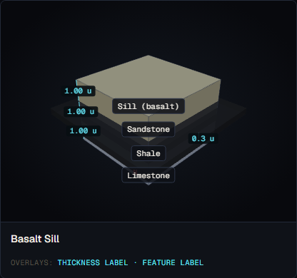
*Screenshot to be captured in Phase A.2.*

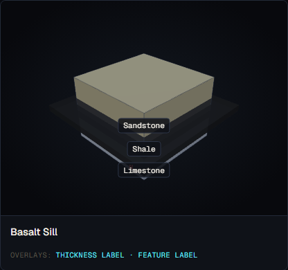
*Screenshot to be captured in Phase A.2.*

### Textbook reference visualisations

**Source 1 — LibreTexts Geosciences (Earle): Intrusive Igneous Bodies**

*Reference image to be downloaded in A.2*

URL: https://geo.libretexts.org/Bookshelves/Geology/Physical_Geology_(Earle)/03:_Intrusive_Igneous_Rocks/3.05:_Intrusive_Igneous_Bodies

Expected content: Fig 3.5.2 — labelled cross-section showing sill as a horizontal tabular body parallel to bedding, labelled "sill." Text explicitly states: "A sill is concordant with existing layering"; further: "a dyke can be horizontal and a sill can be vertical (if the bedding is vertical)" — confirming that concordance, not absolute orientation, is the defining property.

*Source: LibreTexts Geosciences, "Physical Geology" (Earle), §3.5 — Intrusive Igneous Bodies, accessed 2026-05-18*

**Source 2 — Wikipedia: Intrusion (geology)**

*Reference image to be downloaded in A.2*

URL: https://en.wikipedia.org/wiki/Intrusion_(geology)

Expected content: Numbered intrusion diagram — item 5 = sill, "parallel to sedimentary beds." The LibreTexts source explicitly defines concordance as the key sill property, not absolute horizontal orientation.

*Source: Wikipedia, "Intrusion (geology)," accessed 2026-05-18*

### Accuracy assessment

| Axis | Assessment | Notes |
|---|---|---|
| Geometry | ⚠ partial | For the reference formation (flat layers), the sill renders correctly: horizontal sheet parallel to horizontal beds. But the architecture does not tilt the sill with the host layers — in any tilted-host scenario the sill remains horizontal, making it geometrically discordant (i.e., it renders like a dyke). This is the central defining failure for a sill. The reference card itself is not wrong, but the renderer cannot correctly represent a sill in the general case. |
| Measurement overlays | ⚠ partial | Thickness double-arrow and feature label are present. No dip or strike overlay (both are `inferred` and = 0, which is correct for a flat sill in flat host). However, the thickness arrow is anchored at `x = 2.7`, off to one side, which is legible but not at the standard measurement-origin position. |
| Labels and terminology | ⚠ partial | Label reads `Sill (basalt)` — correct. No label stating "concordant — parallel to bedding." No cross-cutting age tag. Without the concordance label, a student cannot distinguish the sill from a flat dyke by labels alone. |
| Misconception risk | ✗ reinforces | Two risks: (1) In the reference formation the sill appears to be "always horizontal" — the mnemonic "sill = flat, dyke = vertical" is a common documented misconception (the real distinction is concordance vs discordance). Nothing in the v1 renderer corrects this. (2) The architectural failure means any user-generated model with a tilted host produces a sill that looks like a dyke. A student who enters "a basalt sill in tilted limestone" sees a geometrically discordant result and may reinforce the wrong mental model. |
| Default parameters | ✓ | `rock_type: 'basalt'` is correct (mafic sills are the canonical example). `thickness: 0.3 u` is appropriate. |

### Severity rating

**Rating:** `misleading`

**Justification:** The reference formation renders correctly for the special case of flat layers, but two issues combine to a `misleading` rating:

1. The architecture-level failure means any tilted-host model renders the sill as geometrically discordant — actively teaching the wrong thing about sill geometry for the general case.
2. The label "concordant — parallel to bedding" is absent, leaving the sill/dyke distinction to geometry alone — and the geometry is wrong in the tilted case.

The reference card itself is not actively wrong, but the renderer cannot be trusted for sills in user-generated tilted models. This is `misleading` rather than `incorrect` only because the reference formation (the one a student sees in the Formation Reference tab) happens to be correct.

### Required v2 work

1. **Fix sill tilt to track host-layer attitude (spec-v2 §5.7 — required).** In `buildIntrusionGeometry()`, read `model.tilt` (or the effective tilt of the host layers) and apply the same rotation to the sill mesh that `buildLayersOnly()` applies to the layer stack. The sill must tilt with the host bedding to remain concordant. This is the architectural fix.

2. **Add concordance label (spec-v2 §5.7 — required).** A secondary label: "concordant — parallel to bedding." Pairs with dyke's "discordant — cuts across bedding."

3. **Add cross-cutting age tag (spec-v2 §5.7 — required).** Same as for dyke — "post-L2" (or the layer below which it intrudes).

### Notes

- The LibreTexts source explicitly states: "A dyke can be horizontal and a sill can be vertical (if the bedding is vertical)." This confirms that the distinction is purely concordance/discordance, not absolute orientation. The v1 reference formation inadvertently teaches the misconception that sills are always horizontal.
- The `dip: 0` and `strike: 0` values are both `inferred` in the JSON — the renderer does not use them to position the sill (the sill is always placed at `y = 0` regardless). These fields are vestigial for the sill subtype.

---

## Intrusions: Batholith

**v1 reference ID:** `batholith-granite`
**Source files involved:** `src/three-helpers.jsx` — `buildIntrusionGeometry()` (subtype `batholith` path), `src/geo-data.jsx` — `REFERENCE_FORMATIONS['batholith-granite']`

### Source-code reading summary

- Builder function: `buildIntrusionGeometry()` in `three-helpers.jsx`, `subtype === 'batholith'` branch (lines 1244–1256)
- REFERENCE_FORMATIONS entry: `geo-data.jsx` → `REFERENCE_FORMATIONS['batholith-granite']`
- Key parameters: `rock_type: 'granite'`, `depth: 3.0`. Three sedimentary layers (shale, sandstone, limestone) overlie the intrusion.
- Known deviations from default geometry: none

**What the builder actually renders:**

1. **Batholith geometry.** A `SphereGeometry(totalHeight * 0.8, 16, 12, 0, Math.PI*2, Math.PI/2, Math.PI/2)` — lower hemisphere (flat face up, dome pointing down). Placed at `y = -halfH` so the flat face touches the bottom of the layer stack. The dome extends below the scene.

2. **Contact character.** The contact is a perfect semicircular arc — mathematically smooth, not irregular. Real batholiths have highly irregular, lobate contacts. The `depth: 3.0` parameter feeds only the overlay label; it does not alter the geometry (the sphere radius is fixed at `totalHeight * 0.8`).

3. **Exposure.** The flat top of the hemisphere is at the base of the sedimentary stack, so the batholith is shown in the subsurface underlying the layers. This is schematically reasonable but may conflict with the definition: a batholith is exposed at the surface (by erosion) with area > 100 km². The v1 model shows a batholith still buried beneath sedimentary cover, which is not the canonical textbook depiction.

4. **What is NOT rendered:**
   - No contact aureole or metamorphic halo.
   - No xenolith inclusions.
   - No irregular contact surface.
   - No cross-cutting age tag.
   - No label indicating the batholith is discordant.

### v1 visualisation

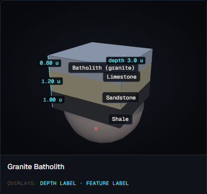
*Screenshot to be captured in Phase A.2.*

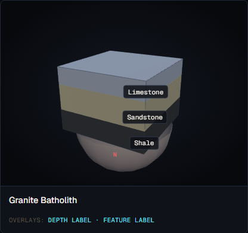
*Screenshot to be captured in Phase A.2.*

### Textbook reference visualisations

**Source 1 — LibreTexts Geosciences (Earle): Intrusive Igneous Bodies**

*Reference image to be downloaded in A.2*

URL: https://geo.libretexts.org/Bookshelves/Geology/Physical_Geology_(Earle)/03:_Intrusive_Igneous_Rocks/3.05:_Intrusive_Igneous_Bodies

Expected content: Fig 3.5.2 — batholith shown as a large irregular body, its surface exposed (not buried under sediments). Text states exposed area > 100 km² and that batholiths often form when multiple stocks coalesce. The Coast Range Plutonic Complex is the reference example.

*Source: LibreTexts Geosciences, "Physical Geology" (Earle), §3.5 — Intrusive Igneous Bodies, accessed 2026-05-18*

**Source 2 — Wikipedia: Intrusion (geology)**

*Reference image to be downloaded in A.2*

URL: https://en.wikipedia.org/wiki/Intrusion_(geology)

Expected content: Numbered diagram item 3 = batholith — large discordant body. Text notes lower contacts are "very rarely exposed." The upper contact defines the surface exposure — batholiths are exposed intrusive bodies, not subsurface ones.

*Source: Wikipedia, "Intrusion (geology)," accessed 2026-05-18*

### Accuracy assessment

| Axis | Assessment | Notes |
|---|---|---|
| Geometry | ⚠ partial | The hemispheric shape is schematically reasonable as a cross-section representation, though real batholiths have irregular contacts, not smooth curves. The placement below the sedimentary layers is misleading: the canonical textbook batholith is exposed at the surface after erosion of the overlying rocks. A student sees a batholith still buried under sediment, which conflicts with the defining characteristic (surface exposure). |
| Measurement overlays | ⚠ partial | A depth label is rendered (dashed line from surface to dome top). However, `depth: 3.0` in the JSON feeds only the label text, not the geometry — the actual dome top is at `domeTopY = -halfH + totalHeight * 0.8`, which may not match the stated depth. The label could misrepresent the actual geometry. |
| Labels and terminology | ⚠ partial | Label reads `Batholith (granite)` — correct terminology. No label for "discordant," no contact aureole indicator, no "exposed at surface" note. |
| Misconception risk | ⚠ subtle | The buried-beneath-sediments presentation may teach that a batholith is a subsurface intrusion like a stock, rather than a large surface-exposed pluton. This is a moderate risk. Students who know batholiths are defined by surface exposure and area > 100 km² will notice the inconsistency. |
| Default parameters | ✓ | `rock_type: 'granite'` is correct (batholiths are almost always felsic). The three sedimentary host layers (shale/sandstone/limestone) are geologically coherent. |

### Severity rating

**Rating:** `minor-confusion`

**Justification:** The batholith is not actively wrong in shape — a hemispherical lower contact is a defensible schematic for a large pluton. The labelling is correct. The main issue (batholith shown buried rather than exposed) is a schematic simplification that could cause minor confusion about what defines a batholith, but is unlikely to produce a lasting misconception in a student who has also read a textbook definition. The absent contact aureole is pedagogically weak but not incorrect. Overall this rates `minor-confusion` rather than `misleading` because the most important defining feature — large granitic intrusion — is correctly represented.

### Required v2 work

1. **Clarify exposure state (spec-v2 §5.7 — optional, may defer to v3).** Either (a) show the batholith with the overlying sediments removed or eroded (so the intrusion crops out at the surface), consistent with the textbook definition, or (b) add an annotation note: "batholiths are exposed at the surface after deep erosion; the overlying rocks shown here were removed by erosion in the real world." This resolves the ambiguity about exposure.

2. **Add cross-cutting age tag (spec-v2 §5.7 — required).** Same as for dyke.

3. **Note depth-label geometry mismatch.** The `depth` field drives only the text of the overlay label, not the rendered geometry. v2 should either compute the label from the actual geometry or use `depth` to set the intrusion position.

### Notes

- The depth-label geometry mismatch (item 3 above) is a minor internal inconsistency. For the reference formation, `depth: 3.0` and `totalHeight = 3.0`, so `domeTopY = -1.5 + 3.0 * 0.8 = -1.5 + 2.4 = 0.9`. The surface is at `y = 1.5`. The actual dome-top-to-surface distance is `1.5 - 0.9 = 0.6 u`, not `3.0 u` as labelled. The label is significantly wrong. This was noted as a v2 issue.
- Contact aureoles and xenoliths are likely v3 scope given their complexity. The v2 requirement is limited to the exposure state and the cross-cutting tag.

---

## Intrusions: Laccolith

**v1 reference ID:** `laccolith-granite`
**Source files involved:** `src/three-helpers.jsx` — `buildIntrusionGeometry()` (subtype `laccolith` path), `src/geo-data.jsx` — `REFERENCE_FORMATIONS['laccolith-granite']`

### Source-code reading summary

- Builder function: `buildIntrusionGeometry()` in `three-helpers.jsx`, `subtype === 'laccolith'` branch (lines 1258–1274)
- REFERENCE_FORMATIONS entry: `geo-data.jsx` → `REFERENCE_FORMATIONS['laccolith-granite']`
- Key parameters: `rock_type: 'granite'`, `depth: 1.5`. Three equal-thickness layers (shale, sandstone, limestone).
- Known deviations from default geometry:
  - Depth clamping: `effectiveDepth = Math.min(rawDepth, laccRadius - minProtrusion)`. With `rawDepth = 1.5`, `laccRadius = totalHeight * 0.4 = 1.2`, `minProtrusion = 1.2 * 0.2 = 0.24`, `effectiveDepth = Math.min(1.5, 1.2 - 0.24) = Math.min(1.5, 0.96) = 0.96`. The stated depth (1.5 u) is clamped to 0.96 u so the dome always protrudes above the top of the stack.
  - Upper hemisphere geometry (`thetaLength = Math.PI/2`) — dome faces upward.

**What the builder actually renders:**

1. **Laccolith shape.** An upper hemisphere (`SphereGeometry` with `thetaStart=0, thetaLength=Math.PI/2`), radius `laccRadius = 1.2 u`, placed at `y = halfH - effectiveDepth = 1.5 - 0.96 = 0.54`. The dome top is at `y = 0.54 + 1.2 = 1.74`, which is above the stack top at `y = 1.5`. The laccolith dome protrudes 0.24 u above the top surface of the layer stack.

2. **Depth clamping (spec-v2 §5.7 known issue).** The `Math.min(rawDepth, laccRadius - minProtrusion)` clamp forces the dome to always reach above the top of the stack by at least `minProtrusion = 0.24 u`, regardless of the stated depth. For `depth: 1.5 u` the stated depth would bury the flat base 1.5 u below the stack top, well below the dome apex — but the clamp overrides this to 0.96 u. The label reads the stated depth (`depth ${intrusion.depth ?? halfH}.toFixed(1) u`), which is `1.5 u`, but the actual dome is at a shallower position.

3. **Dome shape.** An upper hemisphere is a reasonable schematic for a laccolith. The canonical textbook description is "flat base and domed roof" — the upper hemisphere (flat bottom, domed top) matches this. The shape is a hemisphere (aspect ratio 1:1), whereas real laccoliths may be more oblate, but this is a reasonable schematic simplification.

4. **Layer doming.** The laccolith dome protrudes above the layer stack top. However, the layers themselves are not deformed — they remain flat rectangular slabs. A real laccolith would dome the overlying layers upward. v1 shows the laccolith as if the overlying material has been eroded away, which is a simplification.

5. **What is NOT rendered:**
   - No domed/arched host layers.
   - No cross-cutting age tag.
   - No concordance label.

### v1 visualisation

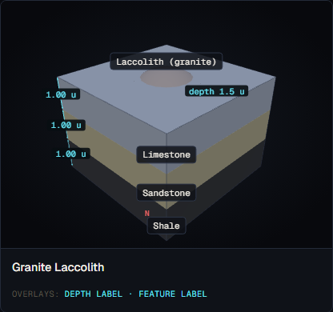
*Screenshot to be captured in Phase A.2.*

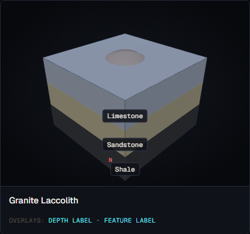
*Screenshot to be captured in Phase A.2.*

### Textbook reference visualisations

**Source 1 — LibreTexts Geosciences (Earle): Intrusive Igneous Bodies**

*Reference image to be downloaded in A.2*

URL: https://geo.libretexts.org/Bookshelves/Geology/Physical_Geology_(Earle)/03:_Intrusive_Igneous_Rocks/3.05:_Intrusive_Igneous_Bodies

Expected content: Fig 3.5.2 — laccolith shown with flat base (concordant with bedding below) and domed upper surface pushing overlying layers into an arch. The overlying layers are bent upward, not horizontal. Caption: "a sill-like body that has expanded upward by deforming the overlying rock."

*Source: LibreTexts Geosciences, "Physical Geology" (Earle), §3.5 — Intrusive Igneous Bodies, accessed 2026-05-18*

**Source 2 — Wikipedia: Intrusion (geology)**

*Reference image to be downloaded in A.2*

URL: https://en.wikipedia.org/wiki/Intrusion_(geology)

Expected content: Numbered diagram item 1 = laccolith — "concordant intrusion with a flat base and domed roof." The host layers above a laccolith are deformed (arched) by the upward pressure of the intrusion. A student should see the overlying layers domed, not flat.

*Source: Wikipedia, "Intrusion (geology)," accessed 2026-05-18*

### Accuracy assessment

| Axis | Assessment | Notes |
|---|---|---|
| Geometry | ⚠ partial | The dome shape (upper hemisphere) is correct for a laccolith. However: (a) the overlying layers are not domed — they remain flat, which fails the primary diagnostic feature ("expanded upward by deforming the overlying rock"); (b) the depth clamp means the stated depth is not honoured geometrically, so the labelled depth is incorrect relative to the rendered position. |
| Measurement overlays | ⚠ partial | Depth label present. However, the depth label value (`1.5 u`) does not match the actual rendered depth (`0.96 u` effective). The label is geometrically incorrect for the reference formation. |
| Labels and terminology | ⚠ partial | Label reads `Laccolith (granite)` — correct. No concordance label. No cross-cutting age tag. The absence of a label indicating that overlying layers are domed means the key defining process (upward deformation of overburden) is not communicated. |
| Misconception risk | ⚠ subtle | Without domed host layers, the laccolith looks like a stock or a partially eroded batholith rather than a laccolith. A student may not understand the key characteristic (magma pressure domed the overburden). The depth-label mismatch (1.5 u labelled vs 0.96 u actual) is a direct factual error that could cause confusion if a student tries to verify the geometry. |
| Default parameters | ✓ | `rock_type: 'granite'` is a reasonable choice (felsic laccoliths are typical). `depth: 1.5 u` is within the shallow-intrusion range expected for laccoliths (<3 km). |

### Severity rating

**Rating:** `misleading`

**Justification:** Three compounding issues push this to `misleading`:

1. The overlying layers are not domed, which is the *defining* geometric feature of a laccolith (it is precisely what distinguishes a laccolith from a sill — the upward deformation of the roof).
2. The depth clamp means the label value does not match the rendered geometry — the labelled measurement is incorrect.
3. Per spec-v2 §5.7, the depth clamping is explicitly called out as something v2 must fix ("v1 clamps the laccolith depth so the dome reaches the surface").

These three together mean a student viewing the formation would not understand the key process (upward doming of overburden) and would see an incorrect depth measurement. This is sufficient for `misleading`.

### Required v2 work

1. **Dome the overlying host layers (spec-v2 §5.7 — required).** The layer slabs above the laccolith emplacement should be deformed to arch over the laccolith dome. This is the primary diagnostic feature of a laccolith. The deformation can be schematic (a simple bezier arch applied to the top surface of each overlying layer slab).

2. **Remove the depth clamp (spec-v2 §5.7 — required).** Remove the `Math.min(rawDepth, laccRadius - minProtrusion)` clamp. Allow the stated depth to control the actual geometry. Add a "show subsurface" toggle (semi-transparent layer cap) so the dome is visible even when it lies below the surface — per spec-v2 §5.7.

3. **Fix depth-label geometry consistency.** The depth overlay label should derive its value from the actual rendered position, not from the raw JSON `depth` field, or the geometry should honour the JSON `depth` field exactly.

4. **Add cross-cutting age tag (spec-v2 §5.7 — required).** Same as for other intrusions.

### Notes

- The depth clamp was presumably added to ensure the laccolith is always visible in the formation reference card (if it were buried at the stated 1.5 u below the top of a 3 u stack, the top of the dome would be at `y = 1.5 - 1.5 + 1.2 = 1.2`, which is still 0.3 u below the stack top — invisible without camera rotation). The v2 "show subsurface" toggle addresses this more correctly than the clamp.

---

## Unconformities: Angular Unconformity

**v1 reference ID:** `angular-unconformity`
**Source files involved:** `src/three-helpers.jsx` — `buildUnconformityGeometry()` (subtype `angular` path), `src/geo-data.jsx` — `REFERENCE_FORMATIONS['angular-unconformity']`

### Source-code reading summary

- Builder function: `buildUnconformityGeometry()` in `three-helpers.jsx` (lines 1387–1472); angular-specific branches at lines 1427–1431 and 1455–1470.
- REFERENCE_FORMATIONS entry: `geo-data.jsx` → `REFERENCE_FORMATIONS['angular-unconformity']`
- Key parameters: 4 layers (old shale, old sandstone, young limestone, young sandstone); `angular_discordance: 35`, `time_gap_ma: 25`, `above_layer_id: 'L3'`, `below_layer_id: 'L2'`. No `model.tilt` field.
- Known deviations from default geometry: **Critical — lower tilted beds are NOT tilted; all beds render horizontally. No THREE.Plane clipping. No geometric angular relationship is present in the rendered geometry at all.**

**What the builder actually renders:**

1. **Shared unconformity geometry (all subtypes).** A wavy line at the contact between `below_layer_id` (L2, old sandstone) and `above_layer_id` (L3, young limestone). The wavy line is drawn in scene space at `contactY` (top of L2). Layers are rendered by `buildLayersOnly()` from the flat model (no tilt applied — `model.tilt` is absent, so all beds are horizontal).

2. **Angular-subtype additions.** A second parallel faint wavy line 0.04 u above the main line (lines 1428–1431) and a discordance arc centred at `(-1.5, contactY, 0)` (lines 1455–1470). The arc runs from horizontal direction `(1, 0, 0)` to a direction `(cos(-dipRad), sin(-dipRad), 0)` — i.e., from horizontal to 35° downward — and is labelled `35°`.

3. **The critical bug — no lower-bed tilt.** The angular unconformity should show **upper horizontal beds** over **lower tilted beds** with an angular discordance. In v1, ALL four beds render as horizontal. The only geometric indication of the angular relationship is the discordance arc (which angles downward from the contact) and the second faint parallel line. A student looking at the model sees four horizontal layers with a wavy line between layers 2 and 3 and a 35° arc — but no actual tilt of the lower beds. The defining geometric characteristic of an angular unconformity (tilted lower strata beneath flat upper strata) is entirely absent from the 3D geometry.

4. **THREE.Plane clipping status.** No `THREE.Plane` clipping is implemented in `buildUnconformityGeometry()`. The spec-v2 §5.6 and the task brief cite a "known clip-through artefact where the lower tilted block protrudes INTO the upper block." In v1, however, the lower beds are not tilted at all — so the clip-through artefact cannot occur because there is no tilted geometry to clip. The clip-through issue is a pre-condition problem: before clipping can be applied, the lower-bed tilt must first be implemented.

5. **Discordance arc placement.** The arc goes from horizontal to a downward-tilted direction at the contact. This represents the angle between the (horizontal) upper beds and the (implied but not rendered) lower beds. It is the correct conceptual measurement, but it is visually unsupported because the lower beds in the rendered scene are flat, not tilted at 35°.

6. **What is NOT rendered:**
   - No tilted lower beds (the defining feature).
   - No THREE.Plane clip of the lower tilted block at the erosion surface.
   - No time gap label in geological terms (only "~25 Ma gap" text overlay).
   - No geological-age strip.

### v1 visualisation

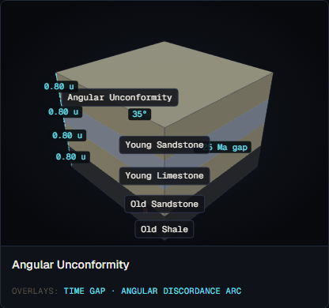
*Screenshot to be captured in Phase A.2.*

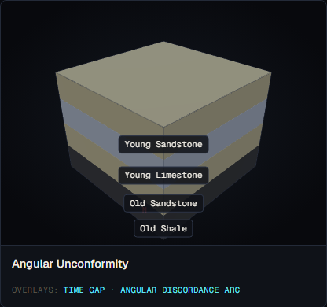
*Screenshot to be captured in Phase A.2.*

### Textbook reference visualisations

**Source 1 — LibreTexts Geosciences (Ruppert et al.): Unconformities**

*Reference image to be downloaded in A.2*

URL: https://geo.libretexts.org/Bookshelves/Geology/Introduction_to_Historical_Geology_(Ruppert_Lacy_and_Haddad)/08:_Geologic_Time/8.03:_Unconformities

Expected content: Fig 1 — three-type labelled cross-section. Angular unconformity clearly shows tilted lower beds (diagonal lines) beneath horizontal upper beds with an erosional contact surface between them. The tilt of the lower beds is the entire visual point of the diagram.

*Source: LibreTexts Geosciences, "Introduction to Historical Geology" (Ruppert, Lacy, Haddad), §8.3 — Unconformities, accessed 2026-05-18*

**Source 2 — Wikipedia: Unconformity**

*Reference image to be downloaded in A.2*

URL: https://en.wikipedia.org/wiki/Unconformity

Expected content: Multiple field photos and diagrams. Angular unconformity defined as "horizontally parallel strata of sedimentary rock are deposited on top of older, tilted and eroded layers." No penetration of upper into lower blocks in any reference — the erosion surface is a bevelled contact, not a clip-through.

*Source: Wikipedia, "Unconformity," accessed 2026-05-18*

### Accuracy assessment

| Axis | Assessment | Notes |
|---|---|---|
| Geometry | ✗ wrong | The lower beds are not tilted. All four beds render as horizontal. The defining geometric characteristic of an angular unconformity — tilted lower strata — is entirely absent from the 3D geometry. The discordance arc is present but unsupported by the actual rendered geometry. |
| Measurement overlays | ✗ wrong | The discordance arc claims to show the angle between upper and lower beds, but since the lower beds are flat (not tilted), the arc is pointing at an angle that does not exist in the rendered scene. The arc is geometrically inconsistent with the model it is drawn on. |
| Labels and terminology | ⚠ partial | "Angular Unconformity" label and "~25 Ma gap" are correct. The 35° discordance value is labelled. However, there is no label distinguishing the old (lower) beds from the young (upper) beds by age or stratigraphic position. |
| Misconception risk | ✗ reinforces | A student viewing this formation would see four horizontal beds with a wavy line between them — indistinguishable from a disconformity — plus a discordance arc that points at a tilt that doesn't exist. This reinforces the misconception that an angular unconformity is just a disconformity with a different label, rather than a fundamentally different geometry. |
| Default parameters | ⚠ partial | `angular_discordance: 35°` is well within the visible range (≥20° required per template). `time_gap_ma: 25` is reasonable. But these parameters feed only labels; they do not drive geometry. |

### Severity rating

**Rating:** `incorrect`

**Justification:** The angular unconformity is the most geometrically incorrect formation in the intrusions and unconformities group. The defining feature — tilted lower strata — is absent. A student using this formation would learn that an angular unconformity is visually identical to a disconformity, which conflicts directly with every textbook definition and diagram. The discordance arc compounds the error by labelling an angle that does not appear in the rendered geometry. This is `incorrect` — not merely misleading.

**Relation to the "clip-through bug."** The task brief and spec-v2 §5.6 reference a clip-through artefact where the lower tilted block protrudes into the upper block. In v1, this bug does not manifest because the lower beds are never tilted at all — the clip-through requires a tilted geometry that v1 does not implement. The clip-through fix (THREE.Plane clipping) cannot be applied until the lower-bed tilt is first implemented. The clip-through issue is a second-order problem; the first-order problem is that the tilted-lower-bed geometry does not exist.

### Required v2 work

1. **Implement lower-bed tilt (spec-v2 §5.6 — required, high priority).** The layers below `below_layer_id` must be rendered as a tilted block (tilted by `angular_discordance` degrees), and the layers above `above_layer_id` must remain horizontal. This requires splitting the layer rendering into two groups: a tilted lower group and a flat upper group. This is the primary fix.

2. **Implement THREE.Plane clipping at the erosion surface (spec-v2 §5.6 — required, applies after item 1).** Once the lower block is tilted, it will protrude through the upper block. Clip the tilted lower block at the erosion-surface plane (the contact between L2 and L3) to produce the correct geometry: lower tilted beds bevelled flat at the unconformity surface.

3. **Fix discordance arc placement.** Once the lower beds are tilted, the arc should connect the actual upper bedding plane to the actual lower bedding plane — not to a computed angle. The current arc vector computation is geometrically correct in principle but will need to be anchored to the actual rendered geometry after the tilt is implemented.

4. **Add geological-age strip (spec-v2 §5.6 — required).** A timescale strip below the model showing the eroded interval as a wavy gap.

### Notes

- The task brief states the clip-through artefact was called out in `todo.md`. The audit did not find an angular unconformity entry in `todo.md` (only `BUG-03` for anticlines/synclines is listed there). The spec-v2 §5.6 is the authoritative reference for this fix.
- The second faint parallel wavy line added for the angular subtype (lines 1428–1431) is a weak visual cue that does not communicate the angular relationship and should be removed once the proper tilt geometry is implemented.

---

## Unconformities: Disconformity

**v1 reference ID:** `disconformity`
**Source files involved:** `src/three-helpers.jsx` — `buildUnconformityGeometry()` (base path), `src/geo-data.jsx` — `REFERENCE_FORMATIONS['disconformity']`

### Source-code reading summary

- Builder function: `buildUnconformityGeometry()` in `three-helpers.jsx` (lines 1387–1472); no subtype-specific branches beyond the angular check (line 1427 — `disconformity` falls through to the base path).
- REFERENCE_FORMATIONS entry: `geo-data.jsx` → `REFERENCE_FORMATIONS['disconformity']`
- Key parameters: 4 layers (lower shale, lower sandstone, upper limestone, upper shale); `time_gap_ma: 15`, `above_layer_id: 'L3'`, `below_layer_id: 'L2'`. No `model.tilt`.
- Known deviations from default geometry: none

**What the builder actually renders:**

1. **Wavy erosion surface.** A sine-wave line at the contact between L2 (lower sandstone) and L3 (upper limestone). Amplitude `0.08 u`, frequency 4 cycles across the block width. This gives a subtle irregular surface.

2. **Parallel beds.** All four layers render as horizontal flat slabs. This is correct for a disconformity — beds above and below the contact are parallel.

3. **Erosion surface waviness.** The wavy line is drawn in 2D (in the X–Y plane, constant Z = 0). It does not show depth variation into the scene — it is a profile line, not a 3D surface. The waviness is subtle (amplitude 0.08 u over a ~4.2 u block width ≈ 2% of block width).

4. **Overlays.** Time gap label "~15 Ma gap" and type label "Disconformity" at the ends of the wavy line.

5. **What is NOT rendered:**
   - No channel features or palaeosol in the erosion surface (confirmed by the Wikipedia source as a characteristic of disconformities).
   - No 3D irregular surface — the erosion surface is only shown in one cross-sectional plane.
   - No time gap on a geological timescale strip.

### v1 visualisation

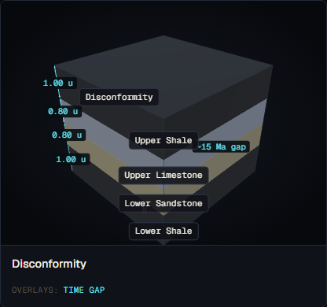
*Screenshot to be captured in Phase A.2.*

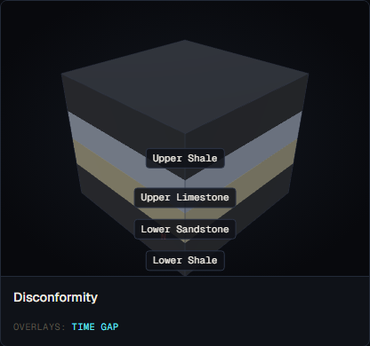
*Screenshot to be captured in Phase A.2.*

### Textbook reference visualisations

**Source 1 — LibreTexts Geosciences (Ruppert et al.): Unconformities**

*Reference image to be downloaded in A.2*

URL: https://geo.libretexts.org/Bookshelves/Geology/Introduction_to_Historical_Geology_(Ruppert_Lacy_and_Haddad)/08:_Geologic_Time/8.03:_Unconformities

Expected content: Fig 1 — three-type diagram. Disconformity shown as parallel beds above and below a horizontal erosional contact, with the contact represented as an irregular or wavy line.

*Source: LibreTexts Geosciences, "Introduction to Historical Geology" (Ruppert, Lacy, Haddad), §8.3 — Unconformities, accessed 2026-05-18*

**Source 2 — Wikipedia: Unconformity**

*Reference image to be downloaded in A.2*

URL: https://en.wikipedia.org/wiki/Unconformity

Expected content: Disconformity defined as "a gap in the geological record that occurs between parallel layers of sedimentary rock." Wikipedia notes that disconformities are marked by features of subaerial erosion including channels and palaeosols — indicating irregular, channeled surfaces.

*Source: Wikipedia, "Unconformity," accessed 2026-05-18*

### Accuracy assessment

| Axis | Assessment | Notes |
|---|---|---|
| Geometry | ✓ matches | Parallel beds above and below the contact — correct for disconformity. Horizontal contact — correct. Wavy line indicating an irregular erosion surface — correct in principle. The contact is depicted as horizontal (the beds are parallel, not dipping), which is correct for a disconformity. |
| Measurement overlays | ⚠ partial | Time gap label "~15 Ma gap" is correct. The type label "Disconformity" is present. However, the wavy erosion surface is only a 2D profile line (constant Z), not a 3D surface, so it would not be visible from a top-down view. No palaeosol or channel features are shown. |
| Labels and terminology | ✓ | "Disconformity" and "~15 Ma gap" are correct terms placed at the contact. No significant labelling gaps for this formation type. |
| Misconception risk | ⚠ subtle | The very subtle waviness (amplitude 0.08 u ≈ 2% of block width) may not be visually prominent enough for a student to register as an erosional surface. At the default camera angle (oblique 3/4 view) the waviness may be hard to see. A student might confuse it with a conformable contact. |
| Default parameters | ✓ | `time_gap_ma: 15` is a reasonable mid-scale gap. Four layers of appropriate sedimentary lithologies. |

### Severity rating

**Rating:** `minor-confusion`

**Justification:** The disconformity renders correctly in all the essential geometric respects: parallel beds, horizontal contact, wavy erosion surface. The issues are of degree and completeness: the waviness is subtle, the surface is 2D not 3D, and channels/palaeosols are absent. These are missed pedagogical opportunities rather than active errors. The formation is not `incorrect` and is unlikely to generate a lasting misconception, but a student could fail to notice the wavy erosion surface and miss the key distinction from a conformable contact.

### Required v2 work

1. **Increase erosion surface amplitude or 3D character (spec-v2 §5.6 — optional).** The current amplitude (0.08 u) is very subtle. Increasing to ~0.15–0.2 u, or adding depth variation (sine in Z as well as X) to make the surface visibly irregular from multiple camera angles, would improve legibility. Optional v2 work; may defer to v3.

2. **Add geological-age strip (spec-v2 §5.6 — required, shared with other unconformities).** Same timescale strip as for angular unconformity.

### Notes

- The disconformity and nonconformity both use the same base wavy-line renderer. The waviness is identical across all three unconformity subtypes — only the angular subtype adds a second faint line and a discordance arc. All three share the "15 Ma gap" → "~15 Ma gap" label format.

---

## Unconformities: Nonconformity

**v1 reference ID:** `nonconformity`
**Source files involved:** `src/three-helpers.jsx` — `buildUnconformityGeometry()` (base path), `src/geo-data.jsx` — `REFERENCE_FORMATIONS['nonconformity']`

### Source-code reading summary

- Builder function: `buildUnconformityGeometry()` in `three-helpers.jsx` (lines 1387–1472); the nonconformity uses the same base wavy-line path as the disconformity.
- REFERENCE_FORMATIONS entry: `geo-data.jsx` → `REFERENCE_FORMATIONS['nonconformity']`
- Key parameters: 3 layers — `L1: granite (basement, thickness 1.5, order 0)`, `L2: sandstone (thickness 1.0, order 1)`, `L3: shale (thickness 1.0, order 2)`. `time_gap_ma: 200`, `above_layer_id: 'L2'`, `below_layer_id: 'L1'`.
- Known deviations from default geometry: none

**What the builder actually renders:**

1. **Layer geometry.** The basement is rendered as a `granite` lithology layer using the granite colour (`#D8C0B0`). The overlying sedimentary layers are sandstone (`#E8D8A8`) and shale (`#4A4A4A`). The visual distinction between granite basement and sedimentary layers is determined by the `LITHOLOGY` colour table — granite is a pale pinkish-buff, which is visually distinct from the sedimentary colours.

2. **Contact surface.** A wavy line at the top of L1 (granite basement), labelled "Nonconformity" and "~200 Ma gap." This correctly marks the contact between the crystalline basement and the overlying sedimentary sequence.

3. **Basement rock type — spec-v2 §5.6 check.** The model specifies `lithology: 'granite'` explicitly in `geo-data.jsx` (line 495). The basement is forced to a crystalline igneous rock. The spec-v2 §5.6 requires "the basement rock is forced to a crystalline lithology (granite, gneiss, schist) with a distinctive texture." The v1 model satisfies the lithology type requirement for the reference formation, but the renderer applies only a colour difference — no distinctive texture rendering distinguishes granite from sedimentary rock beyond colour.

4. **Crystalline basement visual distinction.** Granite colour (`#D8C0B0`) is pale pink-buff. The sedimentary layers are sandstone (`#E8D8A8` — tan) and shale (`#4A4A4A` — near-black). The contrast is modest: granite and sandstone are both pale warm colours and could be confused at a glance, especially at oblique camera angles where the layer faces show only thin edge colours.

5. **Contact label.** The label "Nonconformity" is correct per spec-v2 §5.6. However, the full label from spec-v2 §5.6 is "nonconformity (sedimentary on crystalline basement)" — v1 only shows "Nonconformity."

6. **What is NOT rendered:**
   - No crystalline texture on the basement (granite pattern, foliation, etc.).
   - No contact metamorphism or baking effect.
   - No explicit label identifying the basement as crystalline/igneous.
   - No geological-age strip.

### v1 visualisation

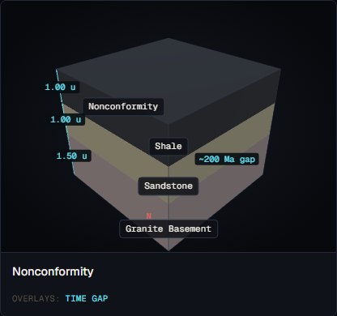
*Screenshot to be captured in Phase A.2.*

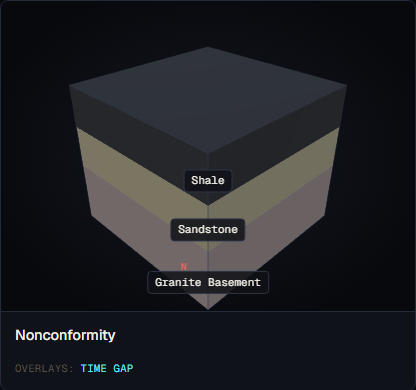
*Screenshot to be captured in Phase A.2.*

### Textbook reference visualisations

**Source 1 — LibreTexts Geosciences (Ruppert et al.): Unconformities**

*Reference image to be downloaded in A.2*

URL: https://geo.libretexts.org/Bookshelves/Geology/Introduction_to_Historical_Geology_(Ruppert_Lacy_and_Haddad)/08:_Geologic_Time/8.03:_Unconformities

Expected content: Fig 1 — three-type diagram. Nonconformity shown with a distinctly different texture or pattern for the crystalline basement (often shown with a granite or gneiss hatch pattern) beneath flat sedimentary beds. The basement pattern is visually distinct from the layered sedimentary pattern.

*Source: LibreTexts Geosciences, "Introduction to Historical Geology" (Ruppert, Lacy, Haddad), §8.3 — Unconformities, accessed 2026-05-18*

**Source 2 — Wikipedia: Unconformity**

*Reference image to be downloaded in A.2*

URL: https://en.wikipedia.org/wiki/Unconformity

Expected content: Nonconformity defined as "sedimentary rock lies above and was deposited on the pre-existing and eroded metamorphic or igneous rock." Field photos from the Grand Canyon show the sharp contact between the pale Proterozoic crystalline basement and the overlying Cambrian sedimentary layers.

*Source: Wikipedia, "Unconformity," accessed 2026-05-18*

### Accuracy assessment

| Axis | Assessment | Notes |
|---|---|---|
| Geometry | ✓ matches | Crystalline basement (granite, thick 1.5 u) below sedimentary sequence (sandstone + shale) with a wavy contact at the top of the basement. Correct geometry for a nonconformity — basement below, sedimentary above, wavy erosion surface. |
| Measurement overlays | ⚠ partial | Time gap "~200 Ma gap" is correct and well-chosen (a 200 Ma gap is plausibly nonconformity-scale, matching the Grand Canyon example ~1 Ga). Type label "Nonconformity" is present. No geological-age strip. |
| Labels and terminology | ⚠ partial | "Nonconformity" is correct. The full spec-v2 label "nonconformity (sedimentary on crystalline basement)" is absent — a student cannot tell from the label alone that the basement must be igneous or metamorphic. The basement layer name in `geo-data.jsx` is "Granite Basement" which does appear as the layer label, providing some hint. |
| Misconception risk | ⚠ subtle | The granite basement (pale pink `#D8C0B0`) and the sandstone layer (tan `#E8D8A8`) are close in colour, making the crystalline/sedimentary distinction visually weak. A student may not recognise the basement as a fundamentally different rock type without a texture or explicit label. However, the layer names ("Granite Basement" vs "Sandstone") are labelled, providing a backup cue. |
| Default parameters | ✓ | `lithology: 'granite'` — correct crystalline basement type. `time_gap_ma: 200` — appropriate for a nonconformity (typically hundreds of Ma). The layer name "Granite Basement" is explicit. |

### Severity rating

**Rating:** `minor-confusion`

**Justification:** The nonconformity has the correct geometry, the correct rock types, and correct labelling at the formation level. The issues are: (1) no crystalline texture to visually distinguish basement from sedimentary, (2) incomplete label (missing "sedimentary on crystalline basement"), and (3) the granite/sandstone colour contrast is modest. These are `minor-confusion` issues — a careful student with the layer names visible can identify the nonconformity correctly, but the visual cues alone are weak. No active error is present.

### Required v2 work

1. **Add crystalline texture to basement (spec-v2 §5.6 — required).** Render the granite/gneiss/schist basement with a distinctive visual texture (e.g. a fabric hatch pattern, a different surface shader, or a stipple pattern) to distinguish it from the flat-colour sedimentary layers. This makes the crystalline/sedimentary distinction immediately visually apparent without relying on the layer name label.

2. **Expand contact label (spec-v2 §5.6 — required).** Change the type label from "Nonconformity" to "Nonconformity (sedimentary on crystalline basement)" per spec-v2 §5.6.

3. **Add geological-age strip (spec-v2 §5.6 — required, shared with other unconformities).** Same timescale strip as for angular unconformity and disconformity.

### Notes

- The reference formation correctly forces `lithology: 'granite'` in the JSON. This satisfies the spec-v2 §5.6 requirement at the data layer. The v2 work is renderer-side (visual texture) and label-side.
- If a user enters a nonconformity description without specifying the basement lithology, the interpreter would need to default to a crystalline type. This is an interpreter requirement, not a renderer requirement — out of scope for this audit but worth noting for the interpreter audit.

---

## Audit Summary

| Formation | v1 ID | Severity |
|---|---|---|
| Dyke | `dyke-basalt` | `misleading` |
| Sill | `sill-basalt` | `misleading` |
| Batholith | `batholith-granite` | `minor-confusion` |
| Laccolith | `laccolith-granite` | `misleading` |
| Angular Unconformity | `angular-unconformity` | `incorrect` |
| Disconformity | `disconformity` | `minor-confusion` |
| Nonconformity | `nonconformity` | `minor-confusion` |

**Severity distribution:**
- `correct`: 0
- `minor-confusion`: 3 (batholith, disconformity, nonconformity)
- `misleading`: 3 (dyke, sill, laccolith)
- `incorrect`: 1 (angular unconformity)

### Key findings

**Angular unconformity (incorrect).** The defining geometric characteristic — tilted lower strata — is entirely absent from the rendered geometry. All beds render horizontally. The discordance arc is present but unsupported by the actual geometry. The THREE.Plane clipping fix (spec-v2 §5.6) cannot be applied until lower-bed tilt is first implemented. The clip-through artefact described in spec-v2 §5.6 and the task brief does not manifest in v1 because the tilted geometry was never implemented.

**Sill tilt (misleading).** The sill does not tilt with dipping host layers. The intrusion geometry is built in a separate group from the layer stack and no tilt from `model.tilt` is applied to it. For the reference formation (flat layers), the sill appears correctly concordant. In any tilted-host scenario the sill renders horizontally (discordant), geometrically indistinguishable from a dyke. This is an architecture-level bug.

**Cross-cutting age tags (absent on all four intrusions).** None of dyke, sill, batholith, or laccolith carry a cross-cutting age tag. All four require this fix per spec-v2 §5.7.

**Depth label mismatch (batholith and laccolith).** Both intrusions have a depth label that reads from the JSON `depth` field without checking whether the geometry actually honours that depth. For the laccolith, the depth clamp means the label is definitively wrong.
