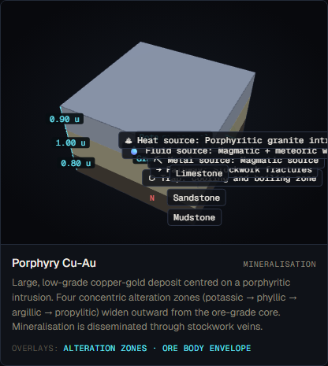
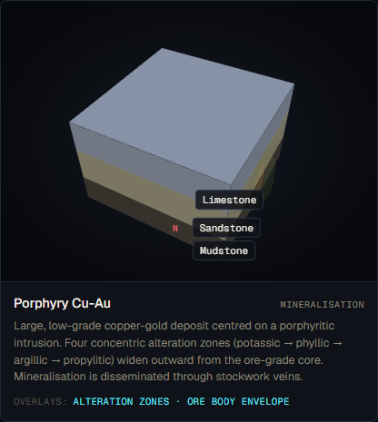
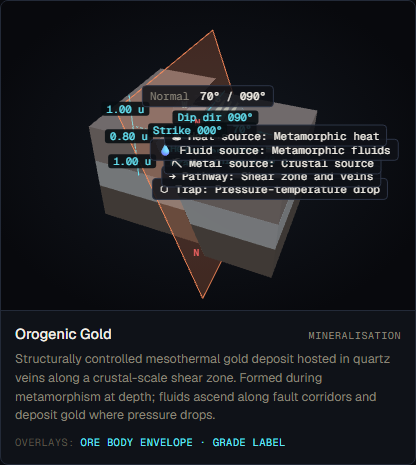
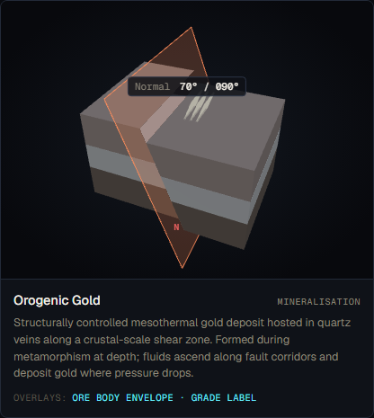
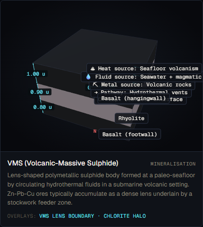
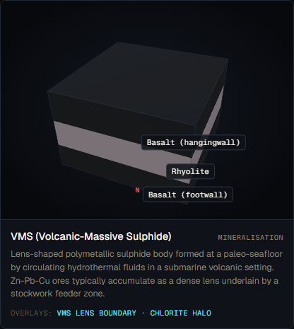
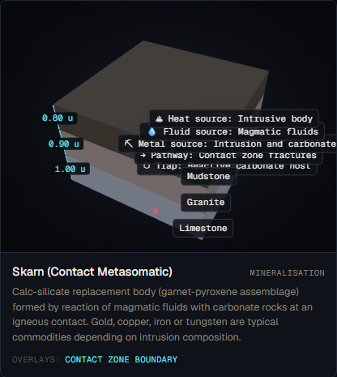
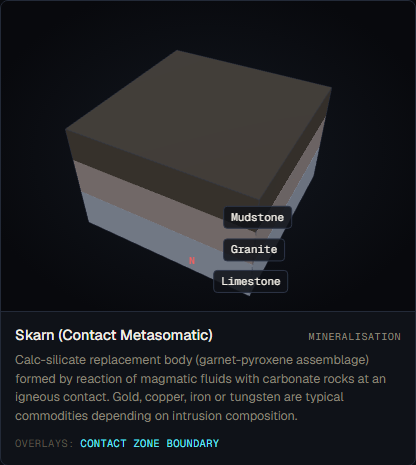
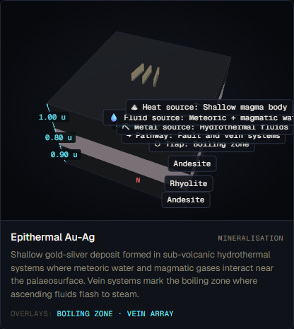
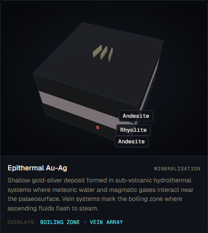

# Mineralisation Formations Audit
*Audited by Phase A.4 (mineralisation group)*
*Auditor branch: phase-a4-mineralisation*

---

## Mineralisation: Porphyry Cu-Au

**v1 reference ID:** `porphyry-cu-au`
**Source files involved:** `three-helpers.jsx` — `buildMineralisationGeometry()` (`case 'porphyry'`), `geo-data.jsx` — `REFERENCE_FORMATIONS['porphyry-cu-au']`

---

### Source-code reading summary

**What `geo-data.jsx` says the model contains:**

- Three sedimentary layers: mudstone (L1, order 0), sandstone (L2, order 1), limestone (L3, order 2). No intrusive event is present — the causative porphyry stock is not modelled as a separate intrusion object.
- One mineralisation event: `subtype: 'porphyry'`, `metals: 'Cu-Au'`, `grade: 0.5` (%), `alteration_radius: 1.0`.
- `five_elements` block present: heat_source = "Porphyritic granite intrusion", pathway = "Stockwork fractures".
- No `intrusions` array — the granite intrusion that drives porphyry mineralisation has no 3D geometry in the scene.

**What `buildMineralisationGeometry()` actually renders for `subtype === 'porphyry'`:**

1. **Four concentric ellipsoidal shells.** Rendered via a `zones` array in the following order:
   - `{ f: 1.00, color: COLOR.minPropyl  }` — propylitic (dark olive, outermost)
   - `{ f: 0.70, color: COLOR.minArgillic }` — argillic (peru brown)
   - `{ f: 0.45, color: COLOR.minPhyllic  }` — phyllic (slate grey)
   - `{ f: 0.25, color: COLOR.minCore     }` — potassic/ore core (gold, innermost)

   The shells are rendered from largest to smallest at the same centre position (`x=1.5, y=oreY`), so the smallest sphere (potassic, f=0.25) is drawn last and appears at the visual centre. Each sphere is elongated vertically (`scale.y = 1.4`) to represent plunge.

2. **Overlay labels.** A second `zoneBoundaries` array (same zone order) generates horizontal-disc overlays and text labels at each shell boundary. Labels read: "Propylitic", "Argillic", "Phyllic", "Potassic (ore)".

3. **What is NOT rendered:**
   - No causative porphyry stock / intrusion body. The granite is described in the `five_elements` text but has no 3D geometry.
   - No stockwork vein texture inside the ore core.
   - No depth-to-ore annotation.
   - No indication that the shells represent hydrothermal alteration overprinting the host stratigraphy.
   - The shells are offset to `x=1.5` (edge of the layer block) rather than centred within the host stratigraphy, making the spatial relationship to the host rock geometrically ambiguous.

---

### v1 visualisation

> *Screenshots to be captured in Phase A.2.*

---

### Textbook reference visualisations

> *Reference images to be downloaded in Phase A.2.*

**Source 1 — Wikipedia: Porphyry Copper Deposit (Cox 1986 USGS cross-section)**

URL: https://en.wikipedia.org/wiki/Porphyry_copper_deposit

Expected content: Cox (1986) USGS Bulletin 1693 idealised cross-section showing concentric alteration envelopes (potassic core, phyllic intermediate, argillic outer, propylitic outermost) centred on the porphyry stock. Confirms potassic = innermost, propylitic = outermost.

*Source: Wikipedia, "Porphyry copper deposit," accessed 2026-05-18*

**Source 2 — USGS Open-File Report 2008-1321: Porphyry Copper Deposit Model**

URL: https://pubs.usgs.gov/of/2008/1321/pdf/OF081321_508.pdf

Expected content: Full porphyry model with zoning diagrams showing innermost potassic (K-feldspar + biotite assemblage) → phyllic (quartz-sericite-pyrite) → argillic (clay minerals) → propylitic (chlorite-epidote) outward from the causative intrusion.

*Source: USGS Open-File Report 2008-1321, accessed 2026-05-18*

---

### Accuracy assessment

| Axis | Assessment | Notes |
|---|---|---|
| Geometry | ⚠ partial | The four concentric shells render in the correct canonical order: potassic innermost (f=0.25), propylitic outermost (f=1.00) — consistent with Wikipedia/Cox 1986 and USGS OF 2008-1321. Shell proportions (0.25 : 0.45 : 0.70 : 1.00) are a reasonable approximation of natural spacing. However, the causative porphyry stock is entirely absent; the shells float alongside a sedimentary layer stack with no intrusive body, making the genetic relationship (shells form around the stock) invisible. The `x=1.5` offset positions the shells at the edge of the layer block rather than centred within the host. |
| Measurement overlays | ⚠ partial | Horizontal-disc overlays and text labels correctly identify each zone boundary. The alteration radius (1.0 u) is shown implicitly by the outermost disc size but is not explicitly labelled as "Alteration radius: 1.0 u." Grade (0.5%) is labelled. No depth annotation. |
| Labels and terminology | ✓ matches | Zone names "Potassic (ore)", "Phyllic", "Argillic", "Propylitic" are the accepted USGS/textbook terms. Grade unit "%" is correct for Cu-Au porphyry. The feature label reads "Porphyry — Cu-Au." |
| Misconception risk | ✗ reinforces | The most significant pedagogical risk: without a visible intrusive stock, a student cannot learn that porphyry alteration is centred on and genetically linked to the causative intrusion. The five_elements panel text mentions "Porphyritic granite intrusion" but nothing in the 3D scene shows this body. A student will see concentric shells alongside a sedimentary sequence and may not understand why or where the alteration is centred. This is the defining principle of a porphyry system (Lowell & Guilbert 1970; Sillitoe 2010) and its absence constitutes a significant misconception risk. |
| Default parameters | ✓ | Grade 0.5% Cu is within typical published ranges for porphyry Cu-Au (0.3%–0.8%; USGS OF 2008-1321). Alteration radius 1.0 u is reasonable. Host lithologies (mudstone/sandstone/limestone) are geologically plausible porphyry wallrocks. |

---

### Severity rating

**Rating:** `misleading`

**Justification:**

The zoning order is correct (potassic innermost, propylitic outermost), and labels are textbook-standard. However, the complete absence of the causative porphyry stock means the scene cannot teach the central principle of a porphyry system: that the concentric alteration shells are genetically and spatially centred on an intrusion. A student viewing the 3D scene would see coloured shells beside a layer stack with no obvious driver, leaving the formational process undefined. The misconception risk axis rates ✗.

---

### Required v2 work

1. **Add causative porphyry stock geometry (spec-v2 §5.8 — required).** Render a vertical elongated ellipsoid (or partial cylinder) at the centre of the alteration shells, styled with the granite lithology colour and labelled "Porphyry stock." The shells must radiate outward from this body, making the stock-centred zonation visually unambiguous.

2. **Centre shells within host stratigraphy (spec-v2 §5.8 — required).** Move the shell centre from `x=1.5` (edge offset) to `x=0` so the alteration zone is embedded in the host rock sequence rather than protruding from the edge. The current offset was a workaround for visibility at default camera angle; with the stock body present, the standard 3/4 camera view will be sufficient.

3. **Add alteration-radius label (spec-v2 §5.8 — optional improvement).** Annotate the outermost disc boundary with "Alteration radius: N u" to make the measurement axis explicit.

---

### Notes

- **Zoning order confirmed correct.** The `zones` array in `buildMineralisationGeometry()` (lines 1495–1499 of `three-helpers.jsx`) renders shells from f=1.00 (propylitic) to f=0.25 (potassic). Because all spheres share the same centre and are rendered in descending size order, the potassic core is always visible at the centre. The overlay `zoneBoundaries` array (lines 1604–1608) matches the same order. This is correct per all primary sources (Wikipedia Cox 1986, USGS OF 2008-1321, Sillitoe 2010).
- **No `applyDefaults` function found** in `geo-data.jsx` for mineralisation — defaults are hard-coded as fallback values in the renderer (`M.alteration_radius || 1.0`, etc.), not via a separate defaults function.
- The porphyry caption in `geo-data.jsx` (line 510) correctly describes "four concentric alteration zones (potassic → phyllic → argillic → propylitic)," confirming the intended order was known during v1 development.

---

## Mineralisation: Orogenic Gold

**v1 reference ID:** `orogenic-gold`
**Source files involved:** `three-helpers.jsx` — `buildMineralisationGeometry()` (`case 'orogenic_gold'`), `geo-data.jsx` — `REFERENCE_FORMATIONS['orogenic-gold']`

---

### Source-code reading summary

**What `geo-data.jsx` says the model contains:**

- Three metamorphic layers: schist (L1, order 0), quartzite (L2, order 1), gneiss (L3, order 2). Host lithologies are geologically appropriate for an orogenic gold setting.
- One fault event: E1, `subtype: 'normal'`, `dip: 70°` east, `strike: 0°`, `throw: 0.4`. This serves as the structural control (labelled in `description_source` as "Shear zone dipping 70° east"). The subtype is `normal` rather than a dedicated `shear_zone` subtype — a terminology approximation.
- One mineralisation event: `subtype: 'orogenic_gold'`, `metals: 'Au'`, `grade: 8.0` (g/t), `structural_control_event_id: 'E1'`, `alteration_radius: 0.3`.
- `five_elements` block present: pathway = "Shear zone and veins", fluid_source = "Metamorphic fluids".

**What `buildMineralisationGeometry()` actually renders for `subtype === 'orogenic_gold'`:**

1. **Three thin vein planes.** Three `BoxGeometry(0.04, totalHeight, R*2.5)` slabs rotated to the strike/dip of E1 (strike=0°, dip=70°). Vein spacing 0.18 u apart. The vein planes extend the full stack height and are oriented to match the structural control event — this correctly depicts a sub-vertical steeply-dipping vein array.
2. **Ore envelope overlay.** A dashed-line rectangular box (`R` wide, `totalHeight * 0.6` tall) centred on `oreY`, labelled "Ore envelope." This depicts the mineralised corridor but as a rectangular box rather than a vein-parallel envelope.
3. **Grade label.** "Grade: 8.0 g/t" (correct unit for gold).
4. **Feature label.** "Orogenic_gold — Au."

**What is NOT rendered:**
- No carbonate alteration halo (canonical diagnostic alteration for orogenic gold — USGS OF 2003-077 states "intense carbonate alteration is always present").
- No sense-of-shear indicators on the controlling structure (E1 is rendered as a generic normal fault, not a shear zone with kinematic arrows).
- The controlling "shear zone" is modelled as `subtype: 'normal'` — a mismatch: orogenic gold shear zones are typically strike-slip or oblique reverse, not normal.
- No depth annotation (orogenic gold typically forms at 4–12 km depth; no depth context shown).
- Feature label uses underscore notation (`Orogenic_gold`) rather than "Orogenic gold".

---

### v1 visualisation

> *Screenshots to be captured in Phase A.2.*

---

### Textbook reference visualisations

> *Reference images to be downloaded in Phase A.2.*

**Source 1 — USGS Open-File Report OF 2003-077: Low-Sulfide Gold Model (Orogenic Gold)**

URL: https://pubs.usgs.gov/of/2003/of03-077/text.htm

Expected content: Figure 10 idealised composite depositional model showing auriferous quartz veins in brittle-ductile shear zones; flower structures; structural control by transcrustal strike-slip faults; depth-pressure setting (4–12 km).

*Source: USGS OF 2003-077, accessed 2026-05-18*

---

### Accuracy assessment

| Axis | Assessment | Notes |
|---|---|---|
| Geometry | ⚠ partial | Vein planes are rendered with the correct steep dip (~70°) and orientation from the structural control event — this is broadly correct for a steeply-dipping shear-zone vein array. However, three equally-spaced parallel slabs are a schematic simplification; real orogenic gold vein systems are irregular networks along a shear zone, not evenly spaced slabs. The `alteration_radius: 0.3` is narrow and the veins thin (0.04 u), which is realistic for individual veins but does not convey the corridor-scale mineralised zone typical of major orogenic deposits. |
| Measurement overlays | ⚠ partial | The ore envelope label is present. Grade labelled correctly in g/t. No alteration radius annotation. The rectangular envelope shape is misleading (see misconception risk). |
| Labels and terminology | ⚠ partial | "Ore envelope" and grade are labelled. Feature label uses underscore (`Orogenic_gold`). No carbonate alteration label. The controlling structure is labelled as a fault (via `buildFaultScene`) but not identified as a shear zone; no kinematic indicators. |
| Misconception risk | ⚠ subtle | Two issues: (1) The structural control event is modelled as `subtype: 'normal'` — this is incorrect for orogenic gold, where structural controls are typically reverse or strike-slip shear zones formed in collisional or transpressional settings (USGS OF 2003-077). A student may learn that orogenic gold forms along normal faults. (2) The rectangular ore envelope does not convey the vein-corridor geometry characteristic of orogenic gold — a student may not understand that structural control means veins follow the shear plane. These are subtle but real misconception risks. |
| Default parameters | ✓ | Grade 8.0 g/t Au is within the published range for high-grade orogenic gold (typically 5–20 g/t; USGS OF 2003-077). Host lithologies (schist, quartzite, gneiss) are geologically appropriate for a metamorphic terrane. Dip 70° is consistent with steeply-dipping shear zones. |

---

### Severity rating

**Rating:** `misleading`

**Justification:**

The vein geometry is directionally correct (steep, structurally controlled) but the misclassification of the host structure as a normal fault (`subtype: 'normal'`) rather than a shear zone or reverse fault actively teaches an incorrect tectonic setting for orogenic gold. USGS OF 2003-077 explicitly states these deposits form in collisional orogens along transcrustal strike-slip and reverse faults. The misconception risk axis rates ⚠, and the labels-and-terminology axis also rates ⚠. Combined, the formation could leave a student with an inaccurate structural-control model.

---

### Required v2 work

1. **Change structural control event subtype (spec-v2 §5.8 — required).** Replace `subtype: 'normal'` with `subtype: 'strike-slip'` or introduce a dedicated `subtype: 'shear_zone'` event type. Label the controlling structure "Shear zone" rather than "Normal fault." Add kinematic (sense-of-shear) arrows.

2. **Add carbonate alteration label (spec-v2 §5.8 — required).** Render a subtle alteration halo around the vein array labelled "Carbonate alteration" — the diagnostic wall-rock alteration for orogenic gold.

3. **Fix feature label formatting (minor).** Replace "Orogenic_gold" with "Orogenic gold" in the `capitalise()` call or the label string.

---

### Notes

- The `structural_control_event_id` linkage mechanism is a well-designed v1 feature: vein planes automatically inherit the strike/dip of the linked structural event. This infrastructure is correct and should be preserved in v2.
- USGS OF 2003-077 notes that orogenic gold veins have "great vertical continuity" (up to 3.2 km depth). The full-stack-height vein rendering in v1 (`totalHeight * 1.0`) is directionally appropriate for this characteristic.

---

## Mineralisation: VMS (Volcanogenic Massive Sulphide)

**v1 reference ID:** `vms-deposit`
**Source files involved:** `three-helpers.jsx` — `buildMineralisationGeometry()` (`case 'vms'`), `geo-data.jsx` — `REFERENCE_FORMATIONS['vms-deposit']`

---

### Source-code reading summary

**What `geo-data.jsx` says the model contains:**

- Three volcanic layers: Basalt footwall (L1, order 0), Rhyolite (L2, order 1), Basalt hangingwall (L3, order 2). The description_source for M1 reads "A VMS deposit forms at the seafloor between the basalt units."
- One mineralisation event: `subtype: 'vms'`, `metals: 'Zn-Pb-Cu'`, `grade: 8.0` (%), `alteration_radius: 0.5`.
- `five_elements` block: pathway = "Hydrothermal vents", trap = "Seafloor interface."

**What `buildMineralisationGeometry()` actually renders for `subtype === 'vms'`:**

1. **Massive sulphide lens.** A flattened sphere (`scale.y = 0.35`) placed at `y = -halfH - R * 0.1` — this is **below the base** of the layer stack, not at the top (seafloor). The intent expressed in `description_source` is "at the seafloor" but the geometry places it beneath the entire stack.
2. **Chlorite halo.** A larger flattened sphere (R*1.5) at the same position, styled green. Labelled "Chlorite halo."
3. **VMS lens overlay disc.** A horizontal disc at `y = -halfH + R * 0.35` (near the base of the stack, slightly above the lens centre), labelled "VMS lens."

**What is NOT rendered:**
- No stringer/feeder zone below the lens (the canonical sub-lens stockwork feeder system).
- No exhalite apron (lateral chemical sediment dispersion).
- No seafloor surface representation (no horizontal plane or contact marking the top of the volcanic sequence).
- No chert/chemical sediment cap above the lens (the siliceous cap that overlies massive sulphide in the Kuroko model).
- The lens is positioned below the layer stack rather than at the seafloor (top of sequence) contact.
- No structural labels distinguishing footwall from hangingwall (geological sense, not fault sense).

---

### v1 visualisation

> *Screenshots to be captured in Phase A.2.*

---

### Textbook reference visualisations

> *Reference images to be downloaded in Phase A.2.*

**Source 1 — Wikipedia: Volcanogenic Massive Sulfide Ore Deposit**

URL: https://en.wikipedia.org/wiki/Volcanogenic_massive_sulfide_ore_deposit

Expected content: Generic VMS cross-section showing stringer/feeder zone at depth, massive sulphide mound at the seafloor surface, exhalite apron extending laterally, and overlying chert cap. Kuroko-type diagram with footwall volcanic sequence below and hangingwall sequence above.

*Source: Wikipedia, "Volcanogenic massive sulfide ore deposit," accessed 2026-05-18*

**Source 2 — USGS SIR 2010-5070-C: VMS Occurrence Model**

URL: https://pubs.usgs.gov/sir/2010/5070/c/SIR10-5070-C.pdf

Expected content: Chapter 5 physical volcanology diagrams showing seafloor vent setting, feeder system, exhalite distribution, and the characteristic bimodal volcanic stratigraphy hosting VMS deposits.

*Source: USGS SIR 2010-5070-C, accessed 2026-05-18*

---

### Accuracy assessment

| Axis | Assessment | Notes |
|---|---|---|
| Geometry | ✗ wrong | The VMS lens is positioned below the base of the layer stack (`y = -halfH - R*0.1`), but canonical VMS deposits form at the seafloor — the top of the volcanic footwall sequence (Wikipedia; USGS SIR 2010-5070-C). In the v1 model, the "Basalt hangingwall" (L3) correctly sits above the deposit in stratigraphy, but the rendered lens sits below all three layers rather than at the L2/L3 contact or the top of L3. The feeder/stringer zone below the lens is entirely absent. The exhalite apron is absent. The chert cap is absent. Only a generic flattened lens with a chlorite halo is shown. |
| Measurement overlays | ⚠ partial | "VMS lens" and "Chlorite halo" boundaries are labelled. Grade (8.0%) labelled. No alteration radius annotation. No seafloor contact marker. |
| Labels and terminology | ⚠ partial | "VMS lens" and "Chlorite halo" labels are present and use accepted terminology. No "Stringer zone," "Exhalite," or "Footwall/Hangingwall" labels. Grade unit "%" is correct for Zn-Pb-Cu VMS. |
| Misconception risk | ✗ reinforces | The lens position below the layer stack is directly contrary to the defining VMS model: these deposits form *at* the seafloor interface, not below the entire volcanic sequence. A student who learns from this visualisation will believe VMS deposits are sub-basement rather than seafloor-hosted — a fundamental error. The absence of the stringer/feeder zone also removes the key diagnostic feature that distinguishes VMS from other sulphide deposit types. |
| Default parameters | ✓ | Grade 8.0% Zn-Pb-Cu is consistent with published high-grade VMS ranges (5–20% combined base metals; Wikipedia). Host volcanics (basalt/rhyolite/basalt) are appropriate for a bimodal mafic-felsic VMS setting. |

---

### Severity rating

**Rating:** `incorrect`

**Justification:**

The geometry axis rates ✗ and the misconception risk axis rates ✗. The lens is rendered below the base of the volcanic sequence rather than at the seafloor (top of the sequence). This is directly contrary to the defining characteristic of VMS deposits per every primary source consulted (Wikipedia; USGS SIR 2010-5070-C). A student using this visualisation would form an incorrect mental model of VMS deposit geometry. The missing stringer zone and exhalite apron are additional omissions but the positional error is the critical issue.

---

### Required v2 work

1. **Reposition VMS lens to the seafloor contact (spec-v2 §5.8 — required, high priority).** Move the lens from `y = -halfH - R*0.1` (below the stack) to `y = halfH - depthTop` where `depthTop` places the lens at or near the top of the footwall sequence (L1/L2 contact or L2/L3 contact). Alternatively, render a seafloor surface plane and anchor the lens to it.

2. **Add stringer/feeder zone below the lens (spec-v2 §5.8 — required).** Render a sub-vertical stockwork zone (thin box geometry or cone) extending downward from the base of the lens into the footwall volcanics, labelled "Stringer (feeder) zone." This is the diagnostic sub-lens alteration pipe.

3. **Add exhalite apron (spec-v2 §5.8 — required).** Render a thin horizontal disc at the lens level extending laterally beyond the lens radius, labelled "Exhalite apron." This conveys the lateral seafloor dispersion of hydrothermal precipitates.

4. **Add seafloor surface marker (spec-v2 §5.8 — optional but strongly recommended).** A horizontal semi-transparent plane at the top of the footwall sequence labelled "Paleo-seafloor" makes the depositional setting immediately clear.

---

### Notes

- The `description_source` in `geo-data.jsx` correctly states "A VMS deposit forms at the seafloor between the basalt units," confirming the intended geometry was known — the renderer did not implement this correctly.
- The chlorite halo is a valid VMS alteration feature (chlorite + sericite wall-rock alteration in the footwall is a canonical exploration vector). Its presence and labelling are correct; the issue is position and completeness.

---

## Mineralisation: Skarn (Contact Metasomatic)

**v1 reference ID:** `skarn-deposit`
**Source files involved:** `three-helpers.jsx` — `buildMineralisationGeometry()` (`case 'skarn'`), `geo-data.jsx` — `REFERENCE_FORMATIONS['skarn-deposit']`

---

### Source-code reading summary

**What `geo-data.jsx` says the model contains:**

- Three layers: limestone (L1, order 0), granite (L2, order 1), mudstone (L3, order 2). The "granite" is modelled as a *layer* with `lithology: 'granite'`, not as an intrusion event. No `intrusions` array is present.
- One mineralisation event: `subtype: 'skarn'`, `metals: 'Fe-Cu'`, `grade: null`, `alteration_radius: 0.4`.
- `five_elements` block: trap = "Reactive carbonate host."
- `description_source`: "Skarn mineralisation at the granite–limestone contact."

**What `buildMineralisationGeometry()` actually renders for `subtype === 'skarn'`:**

1. **Single flattened sphere.** `SphereGeometry(R)` with `scale.set(1.5, 0.6, 0.8)`, offset to `position.set(1.5, oreY, 0)`. A single blob near the edge of the layer block.
2. **Skarn contact zone overlay disc.** `horizontalDisc` at `(0.8, oreY, 0)` with radius `R * 1.4`, labelled "Skarn contact zone."
3. **Feature label:** "Skarn — Fe-Cu."

**What is NOT rendered:**
- No distinction between endoskarn (within the granite body) and exoskarn (within the limestone host).
- No spatial relationship to the intrusion–carbonate contact. The granite is a layer, not a body with a contact, so the concept of metasomatism across a contact is not geometrically expressed.
- No mineralogical zonation (canonical proximal garnet → distal pyroxene; EarthSci.org).
- No intrusive body geometry; the granite layer is indistinguishable from sedimentary strata in the 3D scene.
- Grade is null — no grade label shown.

---

### v1 visualisation

> *Screenshots to be captured in Phase A.2.*

---

### Textbook reference visualisations

> *Reference images to be downloaded in Phase A.2.*

**Source 1 — EarthSci.org: Skarn Deposits**

URL: https://earthsci.org/mineral/mindep/skarn/skarn.html

Expected content: General skarn deposit diagram showing porphyry-to-skarn spatial relationship; endoskarn within the pluton; exoskarn in the carbonate host; proximal garnet → distal pyroxene zonation; cross-section geometry with clear intrusion-carbonate contact.

*Source: EarthSci.org, "Skarn Deposits," accessed 2026-05-18*

---

### Accuracy assessment

| Axis | Assessment | Notes |
|---|---|---|
| Geometry | ✗ wrong | A skarn is defined by its position at the contact between an intrusive body and carbonate wallrocks (EarthSci.org). In v1, the granite is modelled as a flat horizontal layer rather than an intrusive body; there is no geometric contact that would drive metasomatism. The single flattened sphere does not convey the contact-zone geometry or the endo/exo distinction. No mineralogical zonation is represented. |
| Measurement overlays | ⚠ partial | "Skarn contact zone" disc and label are present. No endo/exo boundary annotation. Alteration radius implicit in disc size but not explicitly labelled. |
| Labels and terminology | ⚠ partial | "Skarn contact zone" is correct terminology. No "Endoskarn" or "Exoskarn" labels (required per spec-v2 §5.8). No mineralogical labels (garnet/pyroxene). Feature label "Skarn — Fe-Cu" is correct. |
| Misconception risk | ✗ reinforces | Two documented misconception risks: (1) Without endoskarn/exoskarn distinction, students cannot understand that skarn formation is a bidirectional metasomatic process occurring on both sides of the contact. (2) Rendering the granite as a horizontal layer misrepresents the fundamental setting: skarns require a discordant pluton, not a conformable sill. A student viewing the scene will not understand that the granite drives the reaction or that it intrudes the limestone. The spec-v2 §5.8 explicitly requires endo/exo labelling. |
| Default parameters | ⚠ partial | `metals: 'Fe-Cu'` is geologically correct for a skarn. `grade: null` means no grade is shown, which is not pedagogically ideal (though grade varies widely for skarns). `alteration_radius: 0.4` is small relative to real skarn systems (which can extend hundreds of metres) but acceptable for a schematic. Host lithologies (limestone/granite/mudstone) are geologically appropriate. |

---

### Severity rating

**Rating:** `incorrect`

**Justification:**

The geometry axis rates ✗: the fundamental setting (intrusion intruding carbonate) is not geometrically expressed. The granite is a horizontal layer, not a pluton with a contact. The endo/exo distinction required by spec-v2 §5.8 is entirely absent. The misconception risk axis rates ✗: a student would learn that skarns are associated with a granite layer, not a granite intrusion — this directly contradicts the definition of contact metasomatism.

---

### Required v2 work

1. **Replace granite layer with intrusion body (spec-v2 §5.8 — required, high priority).** Remove the granite `layer` entry and replace with an `intrusions` array entry (stock or batholith subtype) positioned so its contact intersects the limestone layer. The skarn mineralisation blob must be positioned at this contact.

2. **Add endoskarn/exoskarn zones (spec-v2 §5.8 — required).** Render two distinct zones labelled "Endoskarn (in granite)" and "Exoskarn (in limestone)" on either side of the intrusion–carbonate contact, with visually distinct colours. EarthSci.org confirms this is the canonical model distinction.

3. **Add mineralogical zonation overlay (spec-v2 §5.8 — optional improvement).** Add concentric zone labels from the contact outward: "Garnet zone (proximal)" and "Pyroxene zone (distal)" within the exoskarn body, per EarthSci.org canonical zonation.

---

### Notes

- The skarn caption in `geo-data.jsx` (line 621) correctly describes "reaction of magmatic fluids with carbonate rocks at an igneous contact," confirming the intended geological setting. The renderer does not achieve this.
- The `five_elements` block correctly identifies "Reactive carbonate host" as the trap — the conceptual model is correct; the geometry is not.
- Skarn `grade: null` is the only formation without a grade label. This is intentional (grade varies by commodity), but a typical grade range note in the caption would aid pedagogy.

---

## Mineralisation: Epithermal Au-Ag

**v1 reference ID:** `epithermal-au-ag`
**Source files involved:** `three-helpers.jsx` — `buildMineralisationGeometry()` (`case 'epithermal'`), `geo-data.jsx` — `REFERENCE_FORMATIONS['epithermal-au-ag']`

---

### Source-code reading summary

**What `geo-data.jsx` says the model contains:**

- Three volcanic layers: Andesite L1 (order 0, `lithology: 'basalt'`), Rhyolite L2 (order 1), Andesite L3 (order 2, `lithology: 'basalt'`). Note: L1 and L3 are named "Andesite" but use `lithology: 'basalt'` — a terminology inconsistency.
- One mineralisation event: `subtype: 'epithermal'`, `metals: 'Au-Ag'`, `grade: 3.5` (g/t), `alteration_radius: 0.5`.
- `five_elements`: trap = "Boiling zone."
- No sulphidation style parameter (no LS/HS distinction in data model).

**What `buildMineralisationGeometry()` actually renders for `subtype === 'epithermal'`:**

1. **Three shallow sub-vertical veins.** Three `BoxGeometry(0.05, veinH, R*1.2)` (where `veinH = totalHeight * 0.4`) positioned near the top of the section at `y = halfH * 0.8`. Each slightly spread in y-rotation (`10 * (i-1)` degrees). Vein height is 40% of total section height — appropriate for shallow veins.
2. **Boiling zone disc.** A horizontal disc at `y = halfH * 0.3`, radius `R + 0.5`, labelled "Paleo-boiling zone" (`inferred: true` — rendered with dashed amber outline). Positioned in the upper third of the section, consistent with shallow paleo-water-table.
3. **Grade label.** "Grade: 3.5 g/t" (correct unit).
4. **Feature label.** "Epithermal — Au-Ag."

**What is NOT rendered:**
- No LS vs HS distinction — generic model only. USGS SIR 2010-5070-Q defines two end-members with distinct vein mineralogy and alteration assemblages.
- The veins are plain box geometry with no branching or blossom-near-surface geometry characteristic of LS epithermal vein systems.
- No clay alteration cap above the boiling zone (HS systems have advanced argillic lithocap).
- No depth-to-paleo-surface annotation.
- L1/L3 named "Andesite" but rendered with basalt lithology colour — minor data inconsistency.

---

### v1 visualisation

> *Screenshots to be captured in Phase A.2.*

---

### Textbook reference visualisations

> *Reference images to be downloaded in Phase A.2.*

**Source 1 — USGS SIR 2010-5070-Q: Descriptive Models for Epithermal Gold-Silver Deposits**

URL: https://pubs.usgs.gov/sir/2010/5070/q/sir20105070q.pdf

Expected content: LS epithermal cross-section (adularia-sericite veins) and HS epithermal cross-section (advanced argillic lithocap, enargite); depth-temperature zonation; boiling zone position relative to paleo-water-table; typical LS vein blossom geometry near palaeosurface.

*Source: USGS SIR 2010-5070-Q, accessed 2026-05-18*

---

### Accuracy assessment

| Axis | Assessment | Notes |
|---|---|---|
| Geometry | ⚠ partial | Three shallow sub-vertical veins in the upper part of the section broadly matches the canonical shallow epithermal setting. Vein height (40% of section) is geologically reasonable. Slight rotational spread conveys a natural vein fan. However, the veins are positioned only in the upper half (`y = halfH * 0.8`) and do not extend toward the boiling zone disc (`y = halfH * 0.3`) — there is a gap between the veins and the boiling disc, meaning the spatial relationship (veins terminate at the boiling zone) is not geometrically clear. |
| Measurement overlays | ⚠ partial | "Paleo-boiling zone" disc is correctly positioned in the upper section and labelled with `inferred: true` (amber dashes) — this is a good pedagogical choice signalling that the boiling zone is interpreted rather than directly observed. Grade labelled correctly in g/t. No depth annotation. |
| Labels and terminology | ⚠ partial | "Paleo-boiling zone" is broadly correct (the boiling zone IS at or near the paleo-water-table in LS systems; USGS SIR 2010-5070-Q). However, the label does not specify whether this is a LS or HS deposit, and the term "Paleo-boiling zone" conflates the boiling zone with the paleo-water-table — these are related but not identical concepts. The boiling zone in LS systems is typically 50–700 m below the paleo-water-table (USGS SIR 2010-5070-Q search results). L1/L3 mislabelled as basalt. No "low-sulphidation" or "adularia-sericite" label. |
| Misconception risk | ⚠ subtle | The generic model does not distinguish LS from HS epithermal styles. A student will learn a single "epithermal" model when in reality the two subtypes have distinctly different alteration, vein mineralogy, and structural settings. This omission is less severe than a positional error but leaves students without the first-order classification. The mislabelling of andesite layers as basalt (lithology field) is a minor error that could cause confusion when the lithology is explicitly described in a label. |
| Default parameters | ✓ | Grade 3.5 g/t Au is within the published range for epithermal Au-Ag deposits (1–20 g/t; USGS SIR 2010-5070-Q search results). Alteration radius 0.5 u is reasonable. Host volcanic sequence (andesite/rhyolite) is appropriate for an epithermal setting. |

---

### Severity rating

**Rating:** `minor-confusion`

**Justification:**

The boiling zone disc is present and labelled, and its position in the upper section is broadly correct for a shallow epithermal system. The geometry is approximately right. The main issues are: (1) the LS/HS distinction is absent (a simplification, not an error), (2) the veins do not geometrically connect to the boiling disc, and (3) layer lithology mislabelling. None of these constitutes an actively wrong teaching, but they collectively create minor confusion. No single axis rates ✗ under the rubric.

---

### Required v2 work

1. **Extend vein geometry to intersect the boiling zone disc (spec-v2 §5.8 — required).** Adjust vein bottom position so veins terminate at or near the boiling zone disc (`y = halfH * 0.3`), making the spatial relationship "veins active at boiling zone" geometrically explicit.

2. **Add LS/HS subtype field and differentiated rendering (spec-v2 §5.8 — optional improvement).** Add a `sulphidation_style` parameter (`'low'` | `'high'`) to the mineralisation data model. For LS: retain current adularia-sericite vein style. For HS: add advanced argillic lithocap zone above boiling disc and render enargite-bearing veins (darker colour). A single reference card showing LS with annotation "Low-sulphidation (adularia-sericite)" is the minimum needed.

3. **Fix andesite lithology mislabelling (minor — spec-v2 §5.1).** Change `lithology: 'basalt'` to `lithology: 'andesite'` for L1 and L3 in `geo-data.jsx` to match the layer names. Requires adding `andesite` to the `LITHOLOGY` catalogue if not already present.

---

### Notes

- The `inferred: true` flag on the "Paleo-boiling zone" label is the correct pedagogical choice — boiling zone interpretation from fluid inclusions is a classic example of a field_origin distinction between stated and inferred data. This should be preserved in v2.
- The boiling zone disc position (`halfH * 0.3`) places it approximately 70% of the way up through the section from the base — this is geometrically consistent with a shallow epithermal setting where the boiling zone is in the upper third of the volcanic sequence. This is broadly defensible against USGS SIR 2010-5070-Q depth ranges (50–700 m below the paleo-water-table).
- The caption in `geo-data.jsx` (line 657) correctly describes "boiling zone where ascending fluids flash to steam" — the text is accurate; the geometry is approximately correct but not fully connected.
